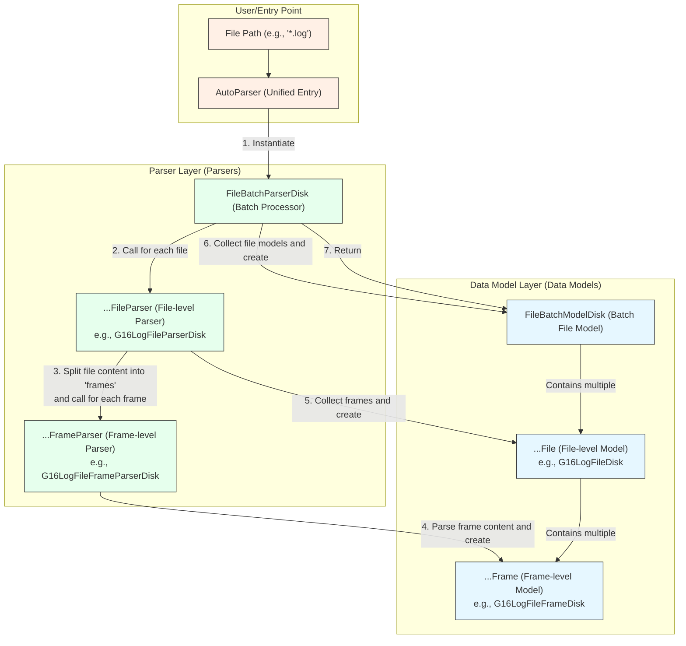
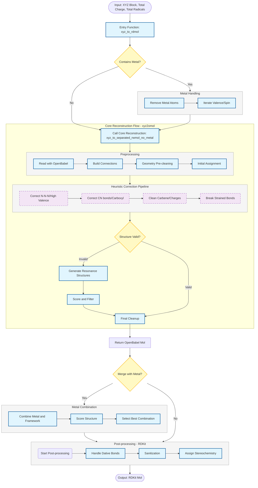

# MolOP (Molecule OPerator) Project Documentation

[中文](README.zh.md) | [English](README.md)

## 1. Overview

`MolOP` is a Python library designed for computational chemistry and molecular modeling. Based on Pydantic, RDKit, and OpenBabel, it provides a powerful and flexible set of tools for parsing chemical files, extracting molecular information, performing structural operations, and calculating molecular descriptors.

The core goal of the library is to automate and simplify the tedious task of processing a large number of chemical calculation files (such as input/output from quantum chemistry software) and to present the data to the user through a clear, type-uniform, and easy-to-use API.

## 2. Core Features

- **Multi-format File Parsing**: Automatically extracts molecular structure, energy, vibrational frequencies, molecular orbitals, population analysis, and other information from common quantum chemistry software (such as Gaussian) and coordinate files (GJF, XYZ, SDF).
- **Robust Structure Recovery**: Built-in unique molecular graph reconstruction algorithm that performs exceptionally well in handling free radicals and metal complexes, far surpassing RDKit's `rdDetermineBonds`.
- **High-performance Batch Processing**: Supports batch parsing of files using wildcards and utilizes multi-core CPU parallel processing to greatly improve efficiency.
- **Powerful Filtering and Operations**: Allows flexible filtering of a batch of molecules based on calculation status (e.g., transition state, optimized structure), properties (charge, multiplicity), and performs batch format conversion.
- **Advanced Structure Editing**: Provides advanced chemical structure and 3D geometry editing functions such as substituent replacement and molecular orientation.
- **Command-Line Interface**: Offers a feature-rich command-line tool that allows users to complete complex data processing workflows in the terminal through chained commands without writing Python scripts.

## 3. Installation

You can install directly from the Git repository via `pip`:

```bash
pip install git+https://github.com/gentle1999/MolOP.git
```

For developers, it is recommended to clone the repository and install using `uv`:

```bash
git clone https://github.com/gentle1999/MolOP.git
cd MolOP
uv sync
```

## 4. Core Architecture

`MolOP` adopts a modular and layered architecture to ensure code maintainability and extensibility.

- **`molop.io` (Input/Output Core)**

  - **Design Pattern**: Adopts a **parser/model separation** design.
    - **Models (`...File`, `...Frame`)**: Based on Pydantic, used to store molecular data in a structured way. For example, `G16LogFile` contains multiple `G16LogFileFrame`s.
    - **Parsers (`...Parser`)**: Contain the parsing logic to extract data from raw text and populate the models.
  - **Batch Processing**: `FileBatchParserDisk` and `FileBatchModelDisk` provide powerful parallel batch file processing capabilities.
  - **Entry Point**: The `AutoParser` function is the recommended user entry point, which automatically selects a parser based on the file extension.

- **`molop.structure` (Molecular Structure Operations)**

  - `GraphReconstruction.py`: Recovers molecular connectivity (bonds) from coordinates.
  - `StructureTransformation.py`: Implements chemical structure editing, such as substituent replacement.
  - `GeometryTransformation.py`: Provides 3D geometry operations, such as molecular orientation.

- **`molop.descriptor` (Molecular Descriptors)**

  - Encapsulates RDKit descriptors and the custom SPMS 3D structure descriptor.

- **`molop.cli` (Command-Line Interface)**

  - Built on the `fire` library, providing powerful terminal tools.

- **`molop.config` (Global Configuration)**
  - Manages logging, parallelism, and other behaviors through the global singleton `molopconfig`.

### 4.1 File Parsing Architecture Diagram

The following diagram illustrates the core architecture of the `molop` file parsing section, clarifying the hierarchical relationships and interaction flow between the components.



### 4.2 Molecular Graph Recovery Module Architecture Diagram

One of the core functions of `MolOP` is to recover the bonding information (i.e., the molecular graph) from atomic coordinates (XYZ).



### 4.3 Pursuit of Pythonic Style and Code Quality

While implementing powerful features, `MolOP` also places great emphasis on code quality, readability, and long-term maintainability. The project has made the following key efforts in pursuing a Pythonic style:

- **Comprehensive Type Hinting**: The entire codebase adheres to strict type hinting specifications. This not only makes the interfaces of functions and classes clear and unambiguous but also allows developers to use static analysis tools like `mypy` to catch potential type errors before the code runs, greatly enhancing the robustness of the code. For collaborators, complete type hints also provide excellent IDE support (such as autocompletion and real-time checking), lowering the barrier to entry.

- **Extensive Use of Generics**: In the `molop.io` module, generics are widely used to define the relationships between parsers and data models. For example, the base class `BaseFileParser[ChemFile, ChemFileFrame, FrameParser]` is a generic class that allows subclasses (like `G16LogFileParser`) to specify the concrete model types they handle (such as `G16LogFile` and `G16LogFileFrame`) upon inheritance.

  This design brings two major benefits:

  1. **Code Reuse and Type Safety**: Generic logic (such as file reading, batch processing) can be implemented in the base class while ensuring strict type safety when subclasses handle specific data types.
  2. **Enhanced Robustness**: Through generic constraints, it can be statically guaranteed that a `G16LogFileParser` will only produce `G16LogFile` and its corresponding `Frame`, effectively preventing runtime errors caused by mismatched parsers and models in complex data flows.

These practices together build a more reliable, extensible, and maintainable codebase, laying a solid foundation for the long-term development of the project.

## 5. Usage Examples

### 5.1 Python API Usage

#### Example 1: Parse a single Gaussian output file and extract information

```python
from molop.io import AutoParser

# Automatically parse the file, AutoParser will return a FileBatchModelDisk object
file_batch = AutoParser("path/to/your/calculation.log")

# Get the first (and only) file object
g16_file = file_batch[0]

# Get the last calculation frame (usually the final structure)
last_frame = g16_file[-1]

# Extract information
print(f"SMILES: {last_frame.to_SMILES()}")
print(f"Total Energy: {last_frame.energies.total_energy}")
print(f"Is it a transition state?: {last_frame.is_TS}")

# Extract vibrational frequencies
if last_frame.vibrations:
    print(f"Vibrational Frequencies (cm-1): {last_frame.vibrations.frequencies}")
```

#### Example 2: Batch process files, filter, and convert format

```python
from molop.io import AutoParser

# Batch parse all .log files in the current directory, using multi-core parallel processing
batch = AutoParser("*.log", n_jobs=-1)

# Filter out all successfully calculated transition state structures
ts_batch = batch.filter_state("ts")

print(f"Found {len(ts_batch)} transition state structures.")

# Convert all found transition state structures to XYZ files in the output directory
ts_batch.format_transform(format="xyz", output_dir=".")
```

### 5.2 Command-Line Tool Usage

The `molop` command-line tool supports chained calls, which is very suitable for rapid data processing.

#### Example 1: Quickly check the status of files

```bash
# Read all .log files and print the path of each file
molop read "*.log" paths
```

#### Example 2: Filter transition states and convert to SDF files

```bash
# 1. Read all .log files
# 2. Filter out calculations with the status "ts" (transition state)
# 3. Convert the filtered structures to "sdf" format
# 4. Merge all structures into a single file named "ts_structures.sdf"
molop read "*.log" filter_state ts transform sdf --output_dir=. --embed_in_one_file=True --file_path=ts_structures.sdf
```

#### Example 3: Filter the optimized structure with the lowest energy

```bash
# 1. Read all .log files
# 2. Filter out optimized structures (opt)
# 3. (Assuming you have your own script or method) Find the structure with the lowest energy based on summary.csv
#    molop itself can generate summary.csv for subsequent analysis
molop read "*.log" filter_state opt summary
```

## 6. Core Classes and Concepts

- **`Molecule`**: The core data structure, representing a molecule, including atoms, coordinates, bonds, charge, multiplicity, etc.
- **`BaseChemFile`**: A base class representing a chemical file, which is a container that can hold one or more "frames".
- **`BaseChemFileFrame`**: Represents a "frame" or a single structure within a file (e.g., a step in an optimization process or a frame in a multi-frame XYZ file). It inherits from `Molecule` and adds computational properties (such as energy, vibrations, etc.).
- **`FileBatchModelDisk`**: A dictionary-like container for managing a batch of `BaseChemFile` objects, providing powerful batch operation methods.
- **`FileBatchParserDisk`**: The class responsible for executing batch file parsing, coordinating the work of the `...Parser` classes.

## 7. Extractable Data Fields

This section details the data fields that can be extracted from different types of files using `MolOP`.

### 7.1 Coordinate File Models

Mainly used for storing molecular structure information, such as XYZ, SDF, GJF files.

#### File-level (`BaseCoordsFile`)

- `charge`: (int) Total molecular charge.
- `multiplicity`: (int) Total molecular multiplicity.

#### Frame-level (`BaseCoordsFrame` / `Molecule`)

Each file can contain one or more frames, and each frame contains the following molecular structure information:

- `frame_id`: (int) Unique identifier for the frame.
- `atoms`: (list[int]) List of atomic numbers.
- `coords`: (NumpyQuantity) Atomic coordinates, in `angstrom`.
- `charge`: (int) Total molecular charge.
- `multiplicity`: (int) Total molecular multiplicity.
- `bonds`: (list) List of bond information, where each bond consists of (atom 1 index, atom 2 index, bond order, stereochemistry).
- `formal_charges`: (list[int]) List of formal charges for each atom.
- `formal_num_radicals`: (list[int]) List of the number of radical electrons on each atom.
- `smiles`: (str) The SMILES expression of the molecule.

### 7.2 Computational Chemistry File Models

Used to store the output of quantum chemistry calculations, such as Gaussian's `.log` files. Contains richer physicochemical properties.

#### File-level (`BaseCalcFile`)

- `qm_software`: (str) Name of the quantum chemistry calculation software (e.g., "Gaussian").
- `qm_software_version`: (str) Software version number.
- `keywords`: (str) Keywords/route section of the calculation task.
- `method`: (str) Calculation method (e.g., "DFT", "HF").
- `basis_set`: (str) Basis set.
- `functional`: (str) Functional.
- `charge`: (int) Total molecular charge.
- `multiplicity`: (int) Total molecular multiplicity.
- `solvent`: (`ImplicitSolvation`) Implicit solvation model information.
  - `solvent`: (str) Name of the solvent (e.g., "Water").
  - `solvent_model`: (str) Name of the solvent model (e.g., "PCM").
  - `atomic_radii`: (str) Type of atomic radii used in the solvent model.
  - `solvent_epsilon`: (float) Dielectric constant of the solvent.
  - `solvent_epsilon_infinite`: (float) Infinite dielectric constant of the solvent.
- `temperature`: (PlainQuantity) Calculation temperature, in `K`.
- `pressure`: (PlainQuantity) Calculation pressure, in `atm`.
- `running_time`: (PlainQuantity) Total calculation time, in `second`.
- `status`: (`Status`) Calculation status of the last frame.

#### Frame-level (`BaseCalcFrame`)

In addition to all the structural information from `BaseCoordsFrame` mentioned above, each frame may also contain the following computational properties:

- **`energies`: `Energies`** - Energy information
  - `electronic_energy`: (PlainQuantity) Electronic energy, in `hartree`.
  - `scf_energy`: (PlainQuantity) SCF energy, in `hartree`.
  - `mp2_energy`: (PlainQuantity) MP2 energy, in `hartree`.
  - `mp3_energy`: (PlainQuantity) MP3 energy, in `hartree`.
  - `mp4_energy`: (PlainQuantity) MP4 energy, in `hartree`.
  - `ccsd_energy`: (PlainQuantity) CCSD energy, in `hartree`.
  - `total_energy`: (PlainQuantity) Total energy automatically selected based on precision, in `hartree`.
- **`thermal_informations`: `ThermalInformations`** - Thermodynamic information
  - `ZPVE`: (PlainQuantity) Zero-point vibrational energy, in `kcal/mol`.
  - `TCE`: (PlainQuantity) Thermal correction to internal energy, in `kcal/mol`.
  - `TCH`: (PlainQuantity) Thermal correction to enthalpy, in `kcal/mol`.
  - `TCG`: (PlainQuantity) Thermal correction to Gibbs free energy, in `kcal/mol`.
  - `U_0`: (PlainQuantity) Zero-point energy, in `kcal/mol`.
  - `U_T`: (PlainQuantity) Internal energy, in `kcal/mol`.
  - `H_T`: (PlainQuantity) Enthalpy, in `kcal/mol`.
  - `G_T`: (PlainQuantity) Gibbs free energy, in `kcal/mol`.
  - `S`: (PlainQuantity) Entropy, in `cal/mol/K`.
  - `C_V`: (PlainQuantity) Constant volume heat capacity, in `cal/mol/K`.
- **`molecular_orbitals`: `MolecularOrbitals`** - Molecular orbital information
  - `electronic_state`: (str) Electronic state.
  - `alpha_energies` / `beta_energies`: (NumpyQuantity) Alpha and Beta orbital energies, in `hartree`.
  - `alpha_occupancies` / `beta_occupancies`: (list[bool]) Alpha and Beta orbital occupancies.
  - `alpha_symmetries` / `beta_symmetries`: (list[str]) Alpha and Beta orbital symmetries.
  - `HOMO_energy` / `LUMO_energy`: (PlainQuantity) Frontier orbital energies.
  - `HOMO_LUMO_gap`: (PlainQuantity) Frontier orbital energy gap.
- **`vibrations`: `Vibrations`** - Vibrational analysis information
  - `frequencies`: (NumpyQuantity) Vibrational frequencies, in `cm^-1`.
  - `reduced_masses`: (NumpyQuantity) Reduced masses, in `amu`.
  - `force_constants`: (NumpyQuantity) Force constants, in `mdyne/angstrom`.
  - `IR_intensities`: (NumpyQuantity) Infrared intensities, in `km/mol`.
  - `vibration_modes`: (list[NumpyQuantity]) Vibration mode vectors.
  - `num_imaginary`: (int) Number of imaginary frequencies.
- **`charge_spin_populations`: `ChargeSpinPopulations`** - Population analysis
  - `mulliken_charges` / `mulliken_spins`: (list[float]) Mulliken charges and spins.
  - `apt_charges`: (list[float]) Atomic polar tensor charges.
  - `lowdin_charges`: (list[float]) Lowdin charges.
  - `hirshfeld_charges` / `hirshfeld_spins`: (list[float]) Hirshfeld charges and spins.
  - `hirshfeld_q_cm5`: (list[float]) Hirshfeld CM5 charges.
  - `npa_charges`: (list[float]) NPA charges.
- **`polarizability`: `Polarizability`** - Polarizability and multipole moments
  - `electronic_spatial_extent`: (PlainQuantity) Electronic spatial extent, in `bohr^2`.
  - `isotropic_polarizability`: (PlainQuantity) Isotropic polarizability, in `bohr^3`.
  - `anisotropic_polarizability`: (PlainQuantity) Anisotropic polarizability, in `bohr^3`.
  - `polarizability_tensor`: (PlainQuantity) Polarizability tensor.
  - `dipole`: (PlainQuantity) Dipole moment, in `debye`.
  - `quadrupole`: (PlainQuantity) Quadrupole moment, in `debye*angstrom`.
  - `octapole`: (PlainQuantity) Octapole moment, in `debye*angstrom^2`.
  - `hexadecapole`: (PlainQuantity) Hexadecapole moment, in `debye*angstrom^3`.
- **`bond_orders`: `BondOrders`** - Bond order information
  - `wiberg_bond_order`: (np.ndarray) Wiberg bond order.
  - `mo_bond_order`: (np.ndarray) MO bond order.
  - `mayer_bond_order`: (np.ndarray) Mayer bond order.
- **`total_spin`: `TotalSpin`** - Total spin information
  - `spin_square`: (float) Value of S\*\*2.
  - `spin_quantum_number`: (float) Spin quantum number S.
- **`single_point_properties`: `SinglePointProperties`** - Single point properties
  - `vip`: (PlainQuantity) Vertical ionization potential, in `eV/particle`.
  - `vea`: (PlainQuantity) Vertical electron affinity, in `eV/particle`.
  - `gei`: (PlainQuantity) Global electrophilicity index, in `eV/particle`.
- **`geometry_optimization_status`: `GeometryOptimizationStatus`** - Geometry optimization status
  - `geometry_optimized`: (bool) Whether the geometry has converged.
  - `max_force` / `rms_force`: (float) Maximum and RMS force.
  - `max_displacement` / `rms_displacement`: (float) Maximum and RMS displacement.
  - `energy_change`: (float) Energy change.
- **`status`: `Status`** - Calculation status of the current frame
  - `scf_converged`: (bool) Whether SCF has converged.
  - `normal_terminated`: (bool) Whether the calculation terminated normally.
- **Other direct fields**
  - `forces`: (NumpyQuantity) Atomic forces, in `hartree/bohr`.
  - `hessian`: (NumpyQuantity) Hessian matrix, in `hartree/bohr^2`.
  - `rotation_constants`: (NumpyQuantity) Rotational constants, in `gigahertz`.

---
