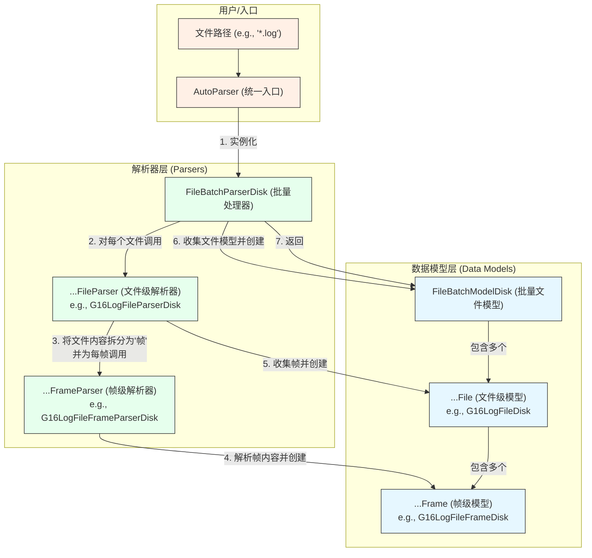
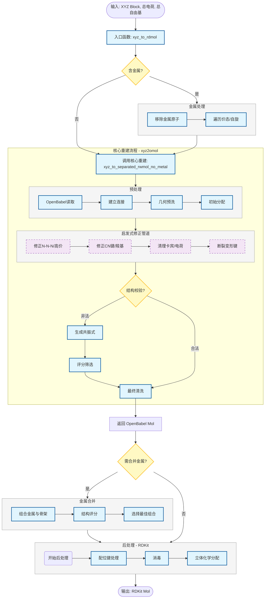

# MolOP (Molecule OPerator) 项目文档

[中文](README.zh.md) | [English](README.md)

## 1. 概述

`MolOP` 是一个专为计算化学和分子建模设计的 Python 库。它基于 Pydantic、RDKit 和 OpenBabel，提供了一套强大而灵活的工具，用于解析化学文件、提取分子信息、执行结构操作和计算分子描述符。

该库的核心目标是自动化和简化处理大量化学计算文件（如量子化学软件的输入/输出）的繁琐任务，并通过一套清晰、类型统一且易于使用的 API 将数据呈现给用户。

## 2. 核心功能

- **多格式文件解析**：自动从常见的量子化学软件（如 Gaussian）和坐标文件（GJF, XYZ, SDF）中提取分子结构、能量、振动频率、分子轨道、布居分析等信息。
- **鲁棒的结构恢复**：内置独特的分子图重构算法，该算法在处理自由基和金属配合物方面表现优异，远超 RDKit 的`rdDetermineBonds`。
- **高性能批量处理**：支持通过通配符对文件进行批量解析，并利用多核 CPU 并行处理，极大提升了效率。
- **强大的筛选与操作**：可以对一批分子根据计算状态（如过渡态、优化结构）、属性（电荷、多重度）进行灵活筛选，并进行批量格式转换。
- **高级结构编辑**：提供取代基替换、分子定向等高级化学结构和三维几何编辑功能。
- **命令行界面**：提供一个功能丰富的命令行工具，允许用户在终端中通过链式命令完成复杂的数据处理工作流，无需编写 Python 脚本。

## 3. 安装

您可以通过 `pip` 从 Git 仓库直接安装：

```bash
pip install git+https://github.com/gentle1999/MolOP.git
```

对于开发者，建议克隆仓库并使用 `uv` 进行安装：

```bash
git clone https://github.com/gentle1999/MolOP.git
cd MolOP
uv sync
```

## 4. 核心架构

`MolOP` 采用模块化的分层架构，确保了代码的可维护性和扩展性。

- **`molop.io` (输入/输出核心)**

  - **设计模式**：采用**解析器/模型分离**的设计。
    - **模型 (`...File`, `...Frame`)**: 基于 Pydantic，用于结构化地存储分子数据。例如 `G16LogFile` 包含多个 `G16LogFileFrame`。
    - **解析器 (`...Parser`)**: 包含解析逻辑，从原始文本中提取数据并填充模型。
  - **批量处理**: `FileBatchParserDisk` 和 `FileBatchModelDisk` 提供了强大的并行批量文件处理能力。
  - **入口**: `AutoParser` 函数是推荐的用户入口，可根据文件扩展名自动选择解析器。

- **`molop.structure` (分子结构操作)**

  - `GraphReconstruction.py`: 从坐标恢复分子连接性（键）。
  - `StructureTransformation.py`: 实现化学结构编辑，如取代基替换。
  - `GeometryTransformation.py`: 提供三维几何操作，如分子定向。

- **`molop.descriptor` (分子描述符)**

  - 封装了 RDKit 描述符和自定义的 SPMS 3D 结构描述符。

- **`molop.cli` (命令行界面)**

  - 基于 `fire` 库构建，提供强大的终端工具。

- **`molop.config` (全局配置)**
  - 通过全局单例 `molopconfig` 管理日志、并行度等行为。

### 4.1 文件解析架构图

下图展示了 `molop` 文件解析部分的核心架构，阐明了各组件之间的层级关系和交互流程。



### 4.2 分子图恢复模块架构图

`MolOP` 的核心功能之一是从原子坐标（XYZ）中恢复分子的成键信息（即分子图）。



### 4.3 对 Pythonic 风格和代码质量的追求

`MolOP` 在实现强大功能的同时，也极度重视代码的质量、可读性和长期可维护性。项目在追求 Pythonic 风格上做了以下关键努力：

- **全面的类型提示 (Type Hinting)**：整个代码库都遵循严格的类型提示规范。这不仅使得函数和类的接口定义清晰明了，还允许开发者利用 `mypy` 等静态分析工具在代码运行前捕获潜在的类型错误，极大地提升了代码的健壮性。对于协作者而言，完善的类型提示也提供了优秀的 IDE 支持（如自动补全和实时检查），降低了上手门槛。

- **泛型编程 (`Generics`) 的广泛应用**：在 `molop.io` 模块中，泛型被广泛用于定义解析器和数据模型之间的关系。例如，基类 `BaseFileParser[ChemFile, ChemFileFrame, FrameParser]` 是一个泛型类，它允许子类（如 `G16LogFileParser`）在继承时指定其处理的具体模型类型（如 `G16LogFile` 和 `G16LogFileFrame`）。

  这种设计带来了两大好处：

  1. **代码复用与类型安全**：通用逻辑（如文件读取、批量处理）可以在基类中实现，同时保证了子类在处理特定数据类型时的严格类型安全。
  2. **增强健壮性**：通过泛型约束，可以从静态层面保证一个 `G16LogFileParser` 只会生成 `G16LogFile` 及其对应的 `Frame`，有效避免了在复杂数据流中因解析器与模型错配而导致的运行时错误。

这些实践共同构建了一个更可靠、更易于扩展和维护的代码库，为项目的长期发展奠定了坚实的基础。

## 5. 使用示例

### 5.1 Python API 使用

#### 示例 1：解析单个高斯输出文件并提取信息

```python
from molop.io import AutoParser

# 自动解析文件，AutoParser会返回一个 FileBatchModelDisk 对象
file_batch = AutoParser("path/to/your/calculation.log")

# 获取第一个（也是唯一一个）文件对象
g16_file = file_batch[0]

# 获取最后一个计算帧（通常是最终结构）
last_frame = g16_file[-1]

# 提取信息
print(f"SMILES: {last_frame.smiles}")
print(f"总能量: {last_frame.energies.total_energy}")
print(f"是否为过渡态: {last_frame.is_TS}")

# 提取振动频率
if last_frame.vibrations:
    print(f"振动频率 (cm-1): {last_frame.vibrations.frequencies.magnitude}")
```

#### 示例 2：批量处理文件、筛选并转换格式

```python
from molop.io import AutoParser

# 批量解析当前目录下所有的 .log 文件，使用多核并行处理
batch = AutoParser("*.log", n_jobs=-1)

# 筛选出所有成功计算的过渡态结构
ts_batch = batch.filter_state("ts")

print(f"找到了 {len(ts_batch)} 个过渡态结构。")

# 将所有找到的过渡态结构转换为一个多帧 XYZ 文件
ts_batch.format_transform(
    format="xyz",
    output_dir=".",
    embed_in_one_file=True,
    file_path="all_transition_states.xyz"
)
```

### 5.2 命令行工具使用

`molop` 命令行工具支持链式调用，非常适合快速数据处理。

#### 示例 1：快速查看文件状态

```bash
# 读取所有 .log 文件，并打印每个文件的路径
molop read "*.log" paths
```

#### 示例 2：筛选过渡态并转换为 SDF 文件

```bash
# 1. 读取所有 .log 文件
# 2. 筛选出状态为 "ts" (过渡态) 的计算
# 3. 将筛选出的结构转换为 "sdf" 格式
# 4. 将所有结构合并到一个名为 "ts_structures.sdf" 的文件中
molop read "*.log" filter_state ts transform sdf --output_dir=. --embed_in_one_file=True --file_path=ts_structures.sdf
```

#### 示例 3：筛选能量最低的优化结构

```bash
# 1. 读取所有 .log 文件
# 2. 筛选出已优化的结构 (opt)
# 3. （假设您有自己的脚本或方法）根据 summary.csv 找到能量最低的结构
#    molop 本身可以生成 summary.csv 方便后续分析
molop read "*.log" filter_state opt summary
```

## 6. 核心类与概念

- **`Molecule`**: 核心数据结构，代表一个分子，包含原子、坐标、键、电荷、多重度等。
- **`BaseChemFile`**: 代表一个化学文件的基类，它是一个容器，可以包含一个或多个“帧”。
- **`BaseChemFileFrame`**: 代表文件中的一个“帧”或一个独立结构（例如，优化过程中的一步或多帧 XYZ 文件中的一帧）。它继承自 `Molecule` 并添加了计算属性（如能量、振动等）。
- **`FileBatchModelDisk`**: 一个类似字典的容器，用于管理一批 `BaseChemFile` 对象，提供了强大的批量操作方法。
- **`FileBatchParserDisk`**: 负责执行批量文件解析的类，协调 `...Parser` 类进行工作。

## 7. 可提取数据字段

本章节详细列出了通过 `MolOP` 可以从不同类型文件中提取的数据字段。

### 7.1 坐标文件模型 (Coordinate File Models)

主要用于存储分子结构信息，如 XYZ, SDF, GJF 文件。

#### 文件级 (`BaseCoordsFile`)

- `charge`: (int) 分子总电荷。
- `multiplicity`: (int) 分子总多重度。

#### 帧级 (`BaseCoordsFrame` / `Molecule`)

每个文件可以包含一个或多个帧，每帧包含以下分子结构信息：

- `frame_id`: (int) 帧的唯一标识符。
- `atoms`: (list[int]) 原子序数列表。
- `coords`: (NumpyQuantity) 原子坐标，单位为 `angstrom`。
- `charge`: (int) 分子总电荷。
- `multiplicity`: (int) 分子总多重度。
- `bonds`: (list) 键信息列表，每个键由 (原子 1 索引, 原子 2 索引, 键级, 立体化学) 组成。
- `formal_charges`: (list[int]) 每个原子的形式电荷列表。
- `formal_num_radicals`: (list[int]) 每个原子的自由基电子数列表。
- `smiles`: (str) 分子的 SMILES 表达式。

### 7.2 计算化学文件模型 (Computational Chemistry File Models)

用于存储量子化学计算的输出，如 Gaussian 的 `.log` 文件。包含更丰富的物理化学属性。

#### 文件级 (`BaseCalcFile`)

- `qm_software`: (str) 量子化学计算软件名称 (e.g., "Gaussian")。
- `qm_software_version`: (str) 软件版本号。
- `keywords`: (str) 计算任务的关键词/路由部分。
- `method`: (str) 计算方法 (e.g., "DFT", "HF")。
- `basis`: (str) 基组。
- `functional`: (str) 泛函。
- `charge`: (int) 分子总电荷。
- `multiplicity`: (int) 分子总多重度。
- `solvent`: (`ImplicitSolvation`) 隐式溶剂化模型信息。
  - `solvent`: (str) 溶剂名称 (e.g., "Water")。
  - `solvent_model`: (str) 溶剂模型名称 (e.g., "PCM")。
  - `atomic_radii`: (str) 溶剂模型中使用的原子半径类型。
  - `solvent_epsilon`: (float) 溶剂介电常数。
  - `solvent_epsilon_infinite`: (float) 溶剂无限介电常数。
- `temperature`: (PlainQuantity) 计算温度，单位为 `K`。
- `pressure`: (PlainQuantity) 计算压力，单位为 `atm`。
- `running_time`: (PlainQuantity) 总计算耗时，单位为 `second`。
- `status`: (`Status`) 最后一帧的计算状态。

#### 帧级 (`BaseCalcFrame`)

除了包含上述 `BaseCoordsFrame` 的所有结构信息外，每一帧还可能包含以下计算属性：

- **`energies`: `Energies`** - 能量信息
  - `electronic_energy`: (PlainQuantity) 电子能量, 单位 `hartree`。
  - `scf_energy`: (PlainQuantity) SCF 能量, 单位 `hartree`。
  - `mp2_energy`: (PlainQuantity) MP2 能量, 单位 `hartree`。
  - `mp3_energy`: (PlainQuantity) MP3 能量, 单位 `hartree`。
  - `mp4_energy`: (PlainQuantity) MP4 能量, 单位 `hartree`。
  - `ccsd_energy`: (PlainQuantity) CCSD 能量, 单位 `hartree`。
  - `total_energy`: (PlainQuantity) 根据精度自动选择的总能量, 单位 `hartree`。
- **`thermal_informations`: `ThermalInformations`** - 热力学信息
  - `ZPVE`: (PlainQuantity) 零点振动能, 单位 `kcal/mol`。
  - `TCE`: (PlainQuantity) 内能热校正, 单位 `kcal/mol`。
  - `TCH`: (PlainQuantity) 焓热校正, 单位 `kcal/mol`。
  - `TCG`: (PlainQuantity) 吉布斯自由能热校正, 单位 `kcal/mol`。
  - `U_0`: (PlainQuantity) 零点能量, 单位 `kcal/mol`。
  - `U_T`: (PlainQuantity) 内能, 单位 `kcal/mol`。
  - `H_T`: (PlainQuantity) 焓, 单位 `kcal/mol`。
  - `G_T`: (PlainQuantity) 吉布斯自由能, 单位 `kcal/mol`。
  - `S`: (PlainQuantity) 熵, 单位 `cal/mol/K`。
  - `C_V`: (PlainQuantity) 定容热容, 单位 `cal/mol/K`。
- **`molecular_orbitals`: `MolecularOrbitals`** - 分子轨道信息
  - `electronic_state`: (str) 电子态。
  - `alpha_energies` / `beta_energies`: (NumpyQuantity) Alpha 和 Beta 轨道能量, 单位 `hartree`。
  - `alpha_occupancies` / `beta_occupancies`: (list[bool]) Alpha 和 Beta 轨道占据情况。
  - `alpha_symmetries` / `beta_symmetries`: (list[str]) Alpha 和 Beta 轨道对称性。
  - `HOMO_energy` / `LUMO_energy`: (PlainQuantity) 前线轨道能量。
  - `HOMO_LUMO_gap`: (PlainQuantity) 前线轨道能级差。
- **`vibrations`: `Vibrations`** - 振动分析信息
  - `frequencies`: (NumpyQuantity) 振动频率, 单位 `cm^-1`。
  - `reduced_masses`: (NumpyQuantity) 约化质量, 单位 `amu`。
  - `force_constants`: (NumpyQuantity) 力常数, 单位 `mdyne/angstrom`。
  - `IR_intensities`: (NumpyQuantity) 红外强度, 单位 `km/mol`。
  - `vibration_modes`: (list[NumpyQuantity]) 振动模式向量。
  - `num_imaginary`: (int) 虚频数量。
- **`charge_spin_populations`: `ChargeSpinPopulations`** - 布居分析
  - `mulliken_charges` / `mulliken_spins`: (list[float]) Mulliken 电荷和自旋。
  - `apt_charges`: (list[float]) 原子极化张量电荷。
  - `lowdin_charges`: (list[float]) Lowdin 电荷。
  - `hirshfeld_charges` / `hirshfeld_spins`: (list[float]) Hirshfeld 电荷和自旋。
  - `hirshfeld_q_cm5`: (list[float]) Hirshfeld CM5 电荷。
  - `npa_charges`: (list[float]) NPA 电荷。
- **`polarizability`: `Polarizability`** - 极化率和多极矩
  - `electronic_spatial_extent`: (PlainQuantity) 电子空间范围, 单位 `bohr^2`。
  - `isotropic_polarizability`: (PlainQuantity) 各向同性极化率, 单位 `bohr^3`。
  - `anisotropic_polarizability`: (PlainQuantity) 各向异性极化率, 单位 `bohr^3`。
  - `polarizability_tensor`: (PlainQuantity) 极化率张量。
  - `dipole`: (PlainQuantity) 偶极矩, 单位 `debye`。
  - `quadrupole`: (PlainQuantity) 四极矩, 单位 `debye*angstrom`。
  - `octapole`: (PlainQuantity) 八极矩, 单位 `debye*angstrom^2`。
  - `hexadecapole`: (PlainQuantity) 十六极矩, 单位 `debye*angstrom^3`。
- **`bond_orders`: `BondOrders`** - 键级信息
  - `wiberg_bond_order`: (np.ndarray) Wiberg 键级。
  - `mo_bond_order`: (np.ndarray) MO 键级。
  - `mayer_bond_order`: (np.ndarray) Mayer 键级。
- **`total_spin`: `TotalSpin`** - 总自旋信息
  - `spin_square`: (float) S\*\*2 的值。
  - `spin_quantum_number`: (float) 自旋量子数 S。
- **`single_point_properties`: `SinglePointProperties`** - 单点性质
  - `vip`: (PlainQuantity) 垂直电离势, 单位 `eV/particle`。
  - `vea`: (PlainQuantity) 垂直电子亲和能, 单位 `eV/particle`。
  - `gei`: (PlainQuantity) 全局亲电指数, 单位 `eV/particle`。
- **`geometry_optimization_status`: `GeometryOptimizationStatus`** - 几何优化状态
  - `geometry_optimized`: (bool) 几何结构是否收敛。
  - `max_force` / `rms_force`: (float) 最大和均方根力。
  - `max_displacement` / `rms_displacement`: (float) 最大和均方根位移。
  - `energy_change`: (float) 能量变化。
- **`status`: `Status`** - 当前帧的计算状态
  - `scf_converged`: (bool) SCF 是否收敛。
  - `normal_terminated`: (bool) 计算是否正常终止。
- **其他直接字段**
  - `forces`: (NumpyQuantity) 原子受力, 单位 `hartree/bohr`。
  - `hessian`: (NumpyQuantity) Hessian 矩阵, 单位 `hartree/bohr^2`。
  - `rotation_constants`: (NumpyQuantity) 转动常数, 单位 `gigahertz`。

---
