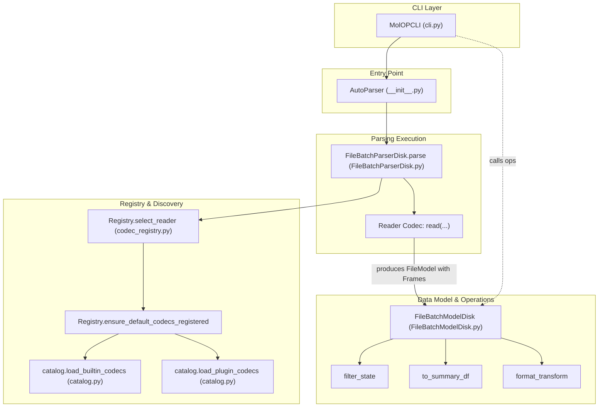

# Core Concepts

This page introduces the core design philosophy and architectural components of MolOP.

## 1. Parsers and AutoParser

MolOP adopts a **parser/model separation** design pattern. Parsers are responsible for extracting data from raw text.

- **AutoParser**: The recommended entry point for users. It automatically identifies and selects the appropriate parser based on file extensions.
- **Unified Interface**: Whether handling a single file or multiple files via wildcards, `AutoParser` returns a consistent batch model object.

## 2. Data Models (Pydantic Models)

All data models in MolOP are built on **Pydantic**, bringing several advantages to computational chemistry data:

- **Type Safety**: Provides comprehensive type hints for IDE completion and static analysis.
- **Structured Data**: Transforms complex calculation outputs (e.g., Gaussian logs) into easy-to-access Python objects.
- **Hierarchical Structure**:
  - `File`: Represents a complete physical file.
  - `Frame`: Represents a single "frame" within a file (e.g., one step in a geometry optimization).

## 3. Registry and Codecs

MolOP features a highly extensible plugin-based architecture:

- **Lazy Registration**: Codecs (read/write logic) are registered only when `AutoParser` is first called or explicitly triggered, ensuring fast library import times.
- **Decoupled Design**: New IO formats can be integrated by adding a `register` function in specific directories without modifying core code.
- **Third-party Support**: Supports registering external codecs via Python entry points.

## 4. Batch Processing

For large-scale computational tasks, MolOP provides robust batch processing support:

- **FileBatchModelDisk**: A dictionary-like container for managing hundreds or thousands of file models.
- **Parallel Acceleration**: Built-in multi-processing support (`n_jobs` parameter) leverages multi-core CPUs to boost parsing efficiency.
- **Chained Operations**: Supports direct filtering (`filter_state`), transformation (`format_transform`), and summarization (`summary`) on batch objects.

## 5. Parsing Dataflow

The following diagram illustrates the dataflow of the MolOP parsing pipeline, from the CLI or API entry point to the final batch model operations.

- **Entry Point**: `AutoParser` is the unified entry point for both single and batch file parsing.
- **Lazy Discovery**: Codecs are discovered and registered only when needed via the `Registry`.
- **Batch Operations**: `FileBatchModelDisk` provides high-level operations like filtering and transformation that can be chained.
