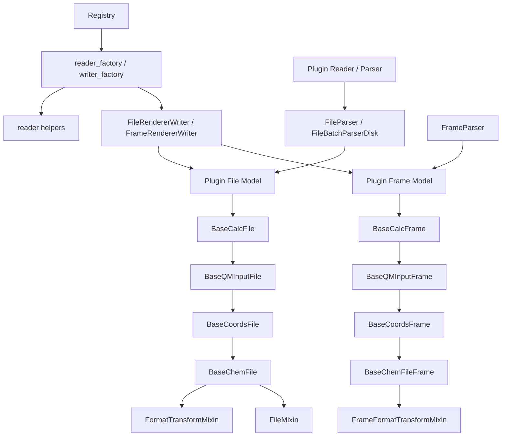
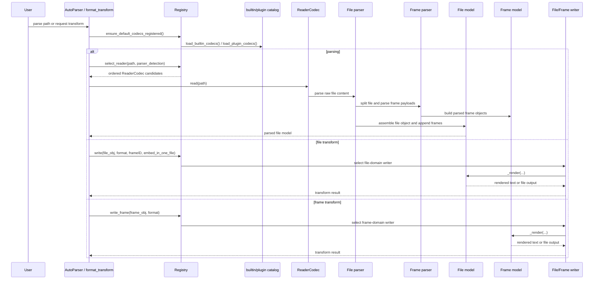

# Contributing

Thank you for your interest in MolOP! We welcome contributions in all forms.

- **Reporting Bugs**: How to submit an effective Issue.
- **Feature Suggestions**: Share your ideas for improving MolOP.
- **Code Contribution Workflow**: Detailed steps from Fork to Pull Request.
- **Development Environment Setup**: How to configure your local development environment.
- **Code Style Guidelines**: Follow Ruff and type checking requirements.
- **Documentation Style Guide**: Use the unified four-layer documentation standard (`style_guide.md`).

## Documentation Quality Assurance

To ensure high-quality documentation, we enforce the following policies:

- **CI Verification**: Every Pull Request triggers a documentation build using `mkdocs build --strict`. This ensures no broken internal links and valid configuration.
- **Translation Policy**:
  - We use `TODO(translate):` as a placeholder for content that has not yet been translated between English and Chinese.
  - Placeholders are allowed in the `main` branch and Pull Requests to enable staged parity.
  - **Release Blockers**: Placeholders are strictly forbidden in release tags (`v*`). The CI will fail if any are detected during a release build.
- **Notebooks**: Jupyter notebooks in the documentation are optional and are not executed by the CI. Please ensure they are pre-executed if you want the output to be visible.

## Developing IO plugins

MolOP's IO stack is deliberately split into three layers: parsing, storage, and registration. Plugins are easiest to maintain when they follow that split instead of putting everything into one class.

### Design principles

- **Files own frame collections and file-level transforms.** `BaseChemFile` is a `Sequence` of frames, stores file-wide metadata such as `charge`, `multiplicity`, and `file_content`, and exposes file-level `format_transform(...)` through `FormatTransformMixin`. Multi-frame behavior such as frame selection and `embed_in_one_file` belongs here.
- **Frames own per-structure data and single-frame rendering.** `BaseChemFileFrame` carries `frame_id`, `frame_content`, and neighbor links (`prev` / `next`). Specializations like `BaseQMInputFrame` and `BaseCalcFrame` add QM metadata, energies, vibrations, and other computed properties.
- **Storage models should preserve raw data first, then normalize.** File/frame models keep raw text (`file_content`, `frame_content`) and parsed fields side-by-side. This is important for round-tripping, debugging, and format-specific rendering like Gaussian fakeG.
- **Rendering should be domain-correct.** File transforms go through `codec_registry.write(...)`; frame transforms go through `codec_registry.write_frame(...)`. Do not fake file rendering by wrapping one frame as a one-frame file, and do not expose a frame writer when the format is only meaningful for whole files.

Relevant runtime files:

- `src/molop/io/base_models/ChemFile.py`
- `src/molop/io/base_models/ChemFileFrame.py`
- `src/molop/io/base_models/Mixins.py`
- `src/molop/io/base_models/_format_transform.py`
- `src/molop/io/codec_registry.py`

### Required behaviors for plugin classes

When you add a new parser or renderer plugin, the following are the behaviors that must exist for the plugin to work in MolOP.

- **The plugin module MUST expose `register(registry)`.** Builtin and third-party codec discovery depends on this function.
- **A reader plugin MUST register at least one `Registry.reader_factory(...)` entry.** That reader must be able to return a parsed file object through its `read(...)` path.
- **A file renderer plugin MUST implement `FileMixin._render_frames_in_one_file(...)`.** This is the entrypoint used when `embed_in_one_file=True`.
- **A file renderer plugin MUST implement `FileMixin._render_frames(...)`.** This is the entrypoint used when a file transform needs per-frame outputs.
- **A frame renderer plugin MUST implement `frame._render(**kwargs)` if it registers `domain="frame"`.** `FrameRendererWriter` depends on the frame class owning single-frame rendering semantics.
- **A file-only format MUST register only `domain="file"`.** If the format has no valid single-frame semantics, do not add a frame writer.
- **A plugin SHOULD preserve raw source text when the format contains meaningful directives or output blocks.** This keeps round-tripping and format-specific rendering possible.

Reference implementations:

- Dual file/frame rendering: `src/molop/io/logic/coords_models/XYZFile.py` and `src/molop/io/logic/coords_frame_models/XYZFileFrame.py`
- File-only rendering: `src/molop/io/logic/QM_models/G16LogFile.py`
- Reader registration: `src/molop/io/logic/qminput_parsers/GJFFileParser.py`

### Minimal plugin example

The following example shows the smallest realistic shape for a plugin that supports file and frame rendering. If your format is file-only, omit the frame writer factory exactly like `fakeg` does in `G16LogFile.py`.

```python
from __future__ import annotations

from collections.abc import Sequence
from typing import TYPE_CHECKING, cast

from molop.io.base_models.ChemFile import BaseCoordsFile
from molop.io.base_models.ChemFileFrame import BaseCoordsFrame, _HasCoords
from molop.io.base_models.Mixins import (
    DiskStorageMixin,
    FileMixin,
    MemoryStorageMixin,
    _HasRenderableFrames,
)

if TYPE_CHECKING:
    from molop.io.codec_registry import Registry


class MyFmtFrameMixin:
    def _render(self, **kwargs) -> str:
        typed_self = cast(_HasCoords, self)
        return "\n".join(
            [
                str(len(typed_self.atoms)),
                f"charge {typed_self.charge} multiplicity {typed_self.multiplicity}",
                *(
                    f"{atom} {x:.6f} {y:.6f} {z:.6f}"
                    for atom, (x, y, z) in zip(
                        typed_self.atom_symbols,
                        typed_self.coords.m,
                        strict=True,
                    )
                ),
            ]
        )


class MyFmtFrameMemory(MemoryStorageMixin, MyFmtFrameMixin, BaseCoordsFrame["MyFmtFrameMemory"]): ...
class MyFmtFrameDisk(DiskStorageMixin, MyFmtFrameMixin, BaseCoordsFrame["MyFmtFrameDisk"]): ...


class MyFmtFileMixin(FileMixin):
    def _render_frames_in_one_file(self, frameID: Sequence[int], **kwargs) -> str:
        typed_self = cast(_HasRenderableFrames, self)
        return "\n\n".join(
            frame._render(**kwargs) for frame in typed_self.frames if frame.frame_id in frameID
        )

    def _render_frames(self, frameID: Sequence[int], **kwargs) -> list[str]:
        typed_self = cast(_HasRenderableFrames, self)
        return [
            frame._render(**kwargs) for frame in typed_self.frames if frame.frame_id in frameID
        ]


class MyFmtFileMemory(MemoryStorageMixin, MyFmtFileMixin, BaseCoordsFile[MyFmtFrameMemory]): ...
class MyFmtFileDisk(DiskStorageMixin, MyFmtFileMixin, BaseCoordsFile[MyFmtFrameDisk]): ...


def register(registry: Registry) -> None:
    from molop.io.codecs._shared.writer_helpers import (
        FileRendererWriter,
        FrameRendererWriter,
        StructureLevel,
    )

    @registry.writer_factory(
        format_id="myfmt",
        required_level=StructureLevel.COORDS,
        domain="file",
        default_graph_policy="coords",
        priority=100,
    )
    def _file_writer():
        return FileRendererWriter(
            format_id="myfmt",
            required_level=StructureLevel.COORDS,
            file_cls=MyFmtFileDisk,
            frame_cls=MyFmtFrameDisk,
            priority=100,
        )

    @registry.writer_factory(
        format_id="myfmt",
        required_level=StructureLevel.COORDS,
        domain="frame",
        default_graph_policy="coords",
        priority=100,
    )
    def _frame_writer():
        return FrameRendererWriter(
            format_id="myfmt",
            required_level=StructureLevel.COORDS,
            frame_cls=MyFmtFrameDisk,
            priority=100,
        )
```

### Data-structure dependency graph

The diagram below shows the dependency direction that plugin authors should preserve. Base file/frame models define storage and traversal semantics, parsers populate those models, and the registry plus writer helpers expose reader/writer behavior on top of them.



Read it as follows:

- inheritance flows from generic base models to format-specific models
- parsers depend on the models they populate
- registration depends on callable factories, not direct model imports from the core runtime
- file renderers may depend on both file and frame classes, but frame renderers should depend only on frame semantics

### Runtime dataflow sequence

The next diagram captures the runtime order for parsing and rendering. This is the sequence you should preserve when adding new codecs or plugin models.



Plugin rule of thumb: add logic at the earliest stable layer that owns the behavior. Parsing belongs in parser modules, file assembly belongs in file models, single-frame semantics belong in frame models, and user-visible availability belongs in registry registration.

### What the base classes already provide

#### File models

Use one of the existing file bases unless you have a very strong reason not to:

- `BaseCoordsFile`: coordinate-only formats
- `BaseQMInputFile`: input formats with coordinates plus lightweight route/resource metadata
- `BaseCalcFile`: calculation/result formats with coordinates, QM metadata, and output properties

These file bases already provide:

- re-iterable `Sequence` behavior over frames
- `append(...)`, `frames`, `__getitem__`, and `__iter__`
- summary helpers (`to_summary_dict`, `to_summary_df`)
- file-content lifecycle helpers (`release_file_content`)
- file-level `format_transform(...)`

If your file model is renderable through the generic registry path, implement the `FileMixin` contract:

- `_render_frames_in_one_file(frameID, **kwargs) -> str`
- `_render_frames(frameID, **kwargs) -> list[str]`

Reference patterns:

- `src/molop/io/logic/qminput_models/GJFFile.py`
- `src/molop/io/logic/QM_models/G16LogFile.py`

#### Frame models

Use one of the frame bases that matches the data level:

- `BaseCoordsFrame`
- `BaseQMInputFrame`
- `BaseCalcFrame`

These frame bases already provide:

- frame identity (`frame_id`)
- frame linkage (`prev`, `next`)
- raw frame text preservation (`frame_content`)
- molecule-level behavior inherited from `Molecule`
- frame-level `format_transform(...)` when a frame writer exists for the target format

Frame renderers should implement format-specific single-frame logic only. File assembly, frame selection, and multi-frame packaging stay on the file model.

### Parser and storage conventions

- **Parsers build models; models do not parse files on demand.** Keep extraction logic in parser modules and model validation/aggregation logic in the model classes.
- **Preserve raw directives where possible.** For QM input/output formats, keep route/resources/title text available in model fields rather than only storing derived semantic values.
- **Normalize with validators, not ad hoc post-processing scripts.** MolOP already relies on model validators to fill derived fields such as method, basis set, and functional information.
- **Containers must remain stable under repeated iteration.** Do not introduce shared cursor state into file/frame collections.

### Registration rules for new formats

Renderers become available only after a module exposes a callable `register(registry)` function. Builtin codec loading scans parser/model packages and invokes that function lazily.

For readers:

- register through `Registry.reader_factory(...)`
- provide a format id, extensions, and priority
- keep parsing logic in parser modules under `src/molop/io/logic/*_parsers`

For writers/renderers:

- register through `Registry.writer_factory(...)`
- choose the correct `domain` explicitly:
  - `domain="file"` for file-level writers
  - `domain="frame"` for frame-level writers
- use `FileRendererWriter` for file renderers and `FrameRendererWriter` for frame renderers
- pick `required_level` carefully:
  - `StructureLevel.COORDS` for coordinate-driven formats
  - `StructureLevel.GRAPH` for graph-preserving formats
- set `default_graph_policy` intentionally rather than relying on guesses

Reference registration files:

- `src/molop/io/logic/qminput_models/GJFFile.py`
- `src/molop/io/logic/coords_models/XYZFile.py`
- `src/molop/io/logic/QM_models/G16LogFile.py`

### File-only vs frame-only support

Not every format should support both file and frame transforms.

- If a format is only meaningful as a whole-file render (for example, a synthetic multi-frame Gaussian log), register only `domain="file"`.
- If a format has valid single-frame semantics, add a separate `domain="frame"` writer.
- If you omit the frame writer, `frame.format_transform(...)` should fail with `UnsupportedFormatError`, which is the correct behavior.

### Generated surfaces you must keep in sync

Registration changes affect generated stubs and CLI typing. If you add or change readers/writers, regenerate or check the generated artifacts in the same work session:

- `uv run python scripts/generate_io_typing_catalog.py`
- `uv run python scripts/generate_chemfile_format_transform_stubs.py`
- `uv run python scripts/generate_cli_transform_stubs.py`

Useful verification commands:

- `uv run pytest <targeted-test>`
- `uv run python scripts/generate_io_typing_catalog.py --check`
- `uv run python scripts/generate_chemfile_format_transform_stubs.py --check`
- `uv run python scripts/generate_cli_transform_stubs.py --check`

### Practical checklist for plugin authors

Before opening a PR for a new parser/renderer plugin, verify that:

1. file and frame responsibilities are separated cleanly
2. raw input/output text is preserved where useful
3. file collections remain re-iterable and stateless
4. registration uses the correct `domain`
5. file-only formats do not accidentally expose frame writers
6. generated stubs and CLI typing are updated
7. at least one targeted test proves the new format is actually parseable or renderable
