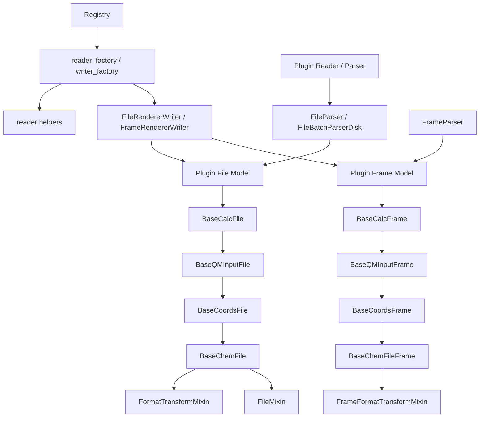
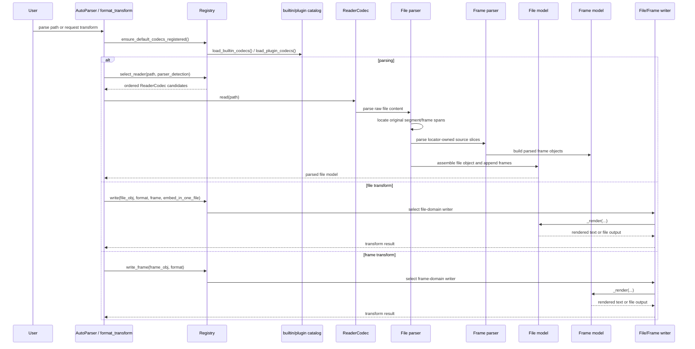

# Complete Parser Contract

This page defines the implementation boundary between MolOP readers, file and
frame models, writers, and the codec registry. It is for contributors adding or
maintaining an IO format.

## Documentation Quality Assurance

To ensure high-quality documentation, we enforce the following policies:

- **CI Verification**: Every Pull Request triggers a documentation build using `mkdocs build --strict`. This ensures no broken internal links and valid configuration.
- **Bilingual pages**: User-facing Chinese and English pages are maintained as
  semantic pairs; release documentation must not contain translation
  placeholders.
- **Output blocks**: Printed values and generated artifacts in Markdown are
  collapsed. README pages use `<details>`, while MkDocs pages use Material
  `??? example` blocks; see [Documentation contributions](../contributing/documentation.md).
- **Notebooks**: Edit notebook code and Markdown cells only. CI executes every
  code cell with `nbconvert --execute` before the MkDocs build, and
  `mkdocs-jupyter` renders the saved outputs. Do not hand-edit `outputs` or
  execution counts.

## Developing IO plugins

MolOP's IO stack is deliberately split into three layers: parsing, storage, and registration. Plugins are easiest to maintain when they follow that split instead of putting everything into one class.

### Design principles

- **Files own frame collections and file-level transforms.** `BaseChemFile` is a `Sequence` of frames, stores file-wide metadata such as `charge`, `multiplicity`, and `file_content`, and exposes file-level `format_transform(...)` through `FormatTransformMixin`. Multi-frame behavior such as frame selection and `embed_in_one_file` belongs here.
- **Frames own per-structure data and single-frame rendering.** `BaseChemFileFrame` carries `frame_id`, `frame_content`, and neighbor links (`prev` / `next`). Specializations like `BaseQMInputFrame` and `BaseCalcFrame` add QM metadata, energies, vibrations, and other computed properties.
- **Storage models should preserve raw data first, then normalize.** File/frame models keep raw text (`file_content`, `frame_content`) and parsed fields side-by-side. This is important for round-tripping, debugging, and format-specific rendering like Gaussian fakeG.
- **Rendering should be domain-correct.** File transforms go through `codec_registry.write(...)`; frame transforms go through `codec_registry.write_frame(...)`. Do not fake file rendering by wrapping one frame as a one-frame file, and do not expose a frame writer when the format is only meaningful for whole files.

Relevant runtime files:

- `src/molop/io/base_models/ChemFile.py`
- `src/molop/io/base_models/ChemFileFrame.py`
- `src/molop/io/base_models/Mixins.py`
- `src/molop/io/base_models/_format_transform.py`
- `src/molop/io/codec_registry.py`

### Minimum parser plugin contract

This section first covers builtin readers added directly under `src/molop/io/logic/` in the MolOP repository. A complete reader for a new format implements three parser methods and one module-level registration function:

| Owner | Required member | Responsibility |
| --- | --- | --- |
| file parser mixin | `format_id` | Declare the canonical lowercase, stripped format identifier. |
| file parser mixin | `_quick_check_file_format()` | Check any stable format fingerprint available near the start of the file. |
| file parser mixin | `_locate_segments()` | Return exact source ranges for all segments and their frames. |
| frame parser mixin | `_parse_frame()` | Parse one locator-provided source slice into fields for the target frame model. |
| `*FileParser.py` module | `register(registry)` | Register the disk reader with the codec registry. |

The file parser itself therefore has two required methods. Counting the frame parser, a complete reader has three required parser methods. `register(registry)` is an integration function, not a parser method.

The following class bindings are also required but do not add methods:

- the disk file parser declares `allowed_formats`, `_frame_parser`, and `_chem_file`
- the disk frame parser declares `_file_frame_class_`
- the format selects `BaseCoordsFile`, `BaseQMInputFile`, or `BaseCalcFile` and the corresponding frame base
- format-specific data lives on format-specific file/frame models; parser mapping keys must match model fields
- memory file/frame parsers are not required for `AutoParser` registration, but are recommended for string parsing and locator unit tests

Do not implement or reintroduce `_split_file()` or `_parse_metadata()`. `_locate_segments()` is the only source of truth for segment/frame boundaries and for the original source slices sent to the frame parser.

#### Locator requirements

`_locate_segments()` must return a non-empty `Sequence[LocatedSourceSegment]` and follow these rules:

- `LocatedTextBlock(start_char, end_char)` is a non-empty half-open character range `[start_char, end_char)` over the original `file_content`.
- Segments are source-ordered and non-overlapping. Every frame is contained by its segment and frames are ordered and non-overlapping within that segment.
- If a segment contains frames, those frame ranges must cover every non-whitespace character in the segment. Pure-whitespace gaps are allowed, for example blank lines between SMILES records. A zero-frame segment may retain arbitrary job metadata.
- Do not call `.strip()`, normalize line endings, or split and rejoin text before calculating ranges. Prefer regular-expression `match.span()` values or `splitlines(keepends=True)` with cumulative character offsets.
- A normal multi-conformer file generally uses one artifact-wide segment containing multiple frames. A multi-job input generally uses one segment per job. A calculation output generally uses one segment per job with multiple geometry frames.
- A segment may contain no frame, such as a calculation job that prints no coordinates. Do not fabricate an empty frame or borrow coordinates from an adjacent job.
- If no valid segment can be located, or the format requires a frame and none is found, raise `FormatMismatchError` or a specific parse error. Never return reconstructed text.

Plugins return character ranges and do not create `SourceSpan` values themselves. The base parser uses the same strict decoding operation to convert those ranges into byte/character/line spans and hashes the exact source bytes. The locator always drives parsing; `capture_source_evidence` controls only whether spans and hashes are attached to output models.

`_quick_check_file_format()` runs both before a full parse and during automatic probing. Probing reads only the first `20_000` characters by default. When a stable leading fingerprint exists, check it here, raise `FormatMismatchError` on mismatch, and do not depend on a file-ending termination marker. A format with no cheap, stable fingerprint may deliberately use a no-op implementation, but its locator or frame extractor must ultimately reject mismatched content.

#### Minimal reader skeleton

This skeleton assumes that `MyFmtFileDisk`, `MyFmtFrameDisk`, and format-specific extractor functions already exist. Keep complex extraction in extractor modules instead of accumulating it in parser classes.

```python
from __future__ import annotations

from collections.abc import Mapping, Sequence
from typing import TYPE_CHECKING, Any, ClassVar

from molop.io.base_models.FileParser import BaseFileParserDisk
from molop.io.base_models.FrameParser import BaseFrameParser, FrameParseContext
from molop.io.base_models.source import LocatedSourceSegment, LocatedTextBlock
from molop.io.codec_exceptions import FormatMismatchError
from molop.io.logic.myfmt.frame_models.MyFmtFrame import MyFmtFrameDisk
from molop.io.logic.myfmt.frame_parsers._myfmt_extractors import (
    extract_myfmt_frame_payload,
)
from molop.io.logic.myfmt.models.MyFmtFile import MyFmtFileDisk
from molop.io.logic.myfmt.parsers._myfmt_file_extractors import (
    has_myfmt_header,
    locate_myfmt_frames,
)

if TYPE_CHECKING:
    from molop.io.codec_registry import Registry


class MyFmtFrameParserMixin:
    def _parse_frame(
        self,
        block: str,
        *,
        context: FrameParseContext,
    ) -> Mapping[str, Any]:
        _ = context
        return extract_myfmt_frame_payload(block)


class MyFmtFrameParserDisk(MyFmtFrameParserMixin, BaseFrameParser[MyFmtFrameDisk]):
    _file_frame_class_ = MyFmtFrameDisk


class MyFmtFileParserMixin:
    format_id: ClassVar[str] = "myfmt"

    @classmethod
    def _quick_check_file_format(cls, file_content: str) -> None:
        if not has_myfmt_header(file_content):
            raise FormatMismatchError("Not a myfmt file.")

    def _locate_segments(
        self,
        file_content: str,
    ) -> Sequence[LocatedSourceSegment]:
        frames: tuple[LocatedTextBlock, ...] = locate_myfmt_frames(file_content)
        return (
            LocatedSourceSegment(
                segment=LocatedTextBlock(0, len(file_content)),
                frames=frames,
            ),
        )


class MyFmtFileParserDisk(
    MyFmtFileParserMixin,
    BaseFileParserDisk[MyFmtFileDisk, MyFmtFrameDisk, MyFmtFrameParserDisk],
):
    allowed_formats = (".myfmt",)
    _frame_parser = MyFmtFrameParserDisk
    _chem_file = MyFmtFileDisk


def register(registry: Registry) -> None:
    from molop.io.codecs._shared.reader_helpers import (
        ParserDiskReader,
        ReaderCodec,
        StructureLevel,
        extensions_for_parser,
    )

    extensions = frozenset(extensions_for_parser(MyFmtFileParserDisk))

    @registry.reader_factory(
        format_id=MyFmtFileParserDisk.format_id,
        extensions=extensions,
        priority=100,
    )
    def _reader() -> ReaderCodec:
        return cast(
            ReaderCodec,
            ParserDiskReader(
                format_id=MyFmtFileParserDisk.format_id,
                extensions=extensions,
                level=StructureLevel.COORDS,
                parser_cls=MyFmtFileParserDisk,
                priority=100,
            ),
        )
```

Use `StructureLevel.COORDS` when atoms and coordinates are the reader's minimum guarantee. Declare `StructureLevel.GRAPH` only when the reader guarantees a valid molecular graph.

#### Optional file parser hooks

| Hook | Use case |
| --- | --- |
| `_parse_artifact_metadata()` | Artifact-wide metadata such as software name and version. |
| `_parse_segment_metadata()` | Per-job/segment metadata such as route, runtime, or termination status. |
| `_prepare_file_metadata()` | Aggregate multiple segments into file-level metadata. |
| `_postprocess_parsed_frame()` | Apply format-owned cross-frame adjustments before append. |
| `_source_frame_role()` | Mark roles such as `initial`, `intermediate`, `terminal`, or `single_point`. |
| `_source_frame_fields()` | Populate format-specific source fields such as `coordinate_source`. |
| `_update_file_metadata_from_frames()` | Backfill file fields from the first or last frame after parsing. |

Do not override a hook when the format has no corresponding semantics. Keep artifact-wide metadata in `_parse_artifact_metadata()` and segment-scoped metadata in `_parse_segment_metadata()`. Do not copy segment facts such as termination status onto every frame unconditionally.

`BaseFrameParser` passes the exact frame text and an immutable `FrameParseContext` into
`_parse_frame(...)`. Read file- and segment-level metadata from `context.additional_data`; do not
store the active block or context on the parser instance. Context metadata is applied after the
format payload when the frame model is assembled, so context values intentionally own collisions.

#### Builtin and external registration boundary

- **Formats builtin to the MolOP repository:** place public modules under `src/molop/io/logic/` with names ending in `*File.py` or `*FileParser.py`. Once the module exposes `register(registry)`, the builtin catalog discovers and lazily registers it. Do not modify MolOP's `pyproject.toml` and do not add an entry point.
- **Separately distributed third-party packages:** these packages are outside the builtin scan. They must expose callable `register(registry)` through a `molop.codecs` entry point in their own `pyproject.toml`, unless the host application registers them explicitly.

Reference implementations:

- Minimal coordinate reader: `src/molop/io/logic/coords/parsers/XYZFileParser.py`
- Multi-job input locator: `src/molop/io/logic/gaussian/input/parsers/GJFFileParser.py`
- Multi-segment calculation output: `src/molop/io/logic/gaussian/log/parsers/G16LogFileParser.py`
- Third-party loading boundary: `src/molop/io/codecs/catalog.py`

### Required renderer plugin behaviors

- **A file-domain writer MUST provide the file-composition semantics from `FileMixin`.** The defaults call each frame's `_render()`; only whole-file formats need to override `_render_frames_in_one_file(...)` or `_render_frames(...)`.
- **A frame renderer MUST implement `frame._render(**kwargs)` when it registers `domain="frame"`.** `FrameRendererWriter` depends on the frame class owning single-frame rendering semantics.
- **A file-only format MUST register only `domain="file"`.** If the format has no valid single-frame semantics, do not add a frame writer.
- **A plugin SHOULD preserve raw source text when the format contains meaningful directives or output blocks.** This keeps round-tripping and format-specific rendering possible.

### Minimal renderer example

The following example shows the smallest realistic shape for a plugin that supports file and frame rendering. If your format is file-only, omit the frame writer factory exactly like `fakeg` does in `G16LogFile.py`.

```python
from __future__ import annotations

from collections.abc import Sequence
from typing import TYPE_CHECKING, cast

from molop.io.base_models.ChemFile import BaseCoordsFile
from molop.io.base_models.ChemFileFrame import BaseCoordsFrame, _HasCoords
from molop.io.base_models.Mixins import (
    DiskStorageMixin,
    FileMixin,
    MemoryStorageMixin,
    _HasRenderableFrames,
)

if TYPE_CHECKING:
    from molop.io.codec_registry import Registry


class MyFmtFrameMixin:
    def _render(self, **kwargs) -> str:
        typed_self = cast(_HasCoords, self)
        return "\n".join(
            [
                str(len(typed_self.atoms)),
                f"charge {typed_self.charge} multiplicity {typed_self.multiplicity}",
                *(
                    f"{atom} {x:.6f} {y:.6f} {z:.6f}"
                    for atom, (x, y, z) in zip(
                        typed_self.atom_symbols,
                        typed_self.coords.m,
                        strict=True,
                    )
                ),
            ]
        )


class MyFmtFrameMemory(MemoryStorageMixin, MyFmtFrameMixin, BaseCoordsFrame["MyFmtFrameMemory"]): ...
class MyFmtFrameDisk(DiskStorageMixin, MyFmtFrameMixin, BaseCoordsFrame["MyFmtFrameDisk"]): ...


class MyFmtFileMixin(FileMixin):
    def _render_frames_in_one_file(self, frame_ids: Sequence[int], **kwargs) -> str:
        typed_self = cast(_HasRenderableFrames, self)
        return "\n\n".join(
            frame._render(**kwargs)
            for frame in typed_self.frames
            if frame.frame_id in frame_ids
        )

    def _render_frames(self, frame_ids: Sequence[int], **kwargs) -> list[str]:
        typed_self = cast(_HasRenderableFrames, self)
        return [
            frame._render(**kwargs)
            for frame in typed_self.frames
            if frame.frame_id in frame_ids
        ]


class MyFmtFileMemory(MemoryStorageMixin, MyFmtFileMixin, BaseCoordsFile[MyFmtFrameMemory]): ...
class MyFmtFileDisk(DiskStorageMixin, MyFmtFileMixin, BaseCoordsFile[MyFmtFrameDisk]): ...


def register(registry: Registry) -> None:
    from molop.io.codecs._shared.writer_helpers import (
        FileRendererWriter,
        FrameRendererWriter,
        StructureLevel,
    )

    @registry.writer_factory(
        format_id="myfmt",
        required_level=StructureLevel.COORDS,
        domain="file",
        default_graph_policy="coords",
        priority=100,
    )
    def _file_writer():
        return FileRendererWriter(
            format_id="myfmt",
            required_level=StructureLevel.COORDS,
            file_cls=MyFmtFileDisk,
            frame_cls=MyFmtFrameDisk,
            priority=100,
        )

    @registry.writer_factory(
        format_id="myfmt",
        required_level=StructureLevel.COORDS,
        domain="frame",
        default_graph_policy="coords",
        priority=100,
    )
    def _frame_writer():
        return FrameRendererWriter(
            format_id="myfmt",
            required_level=StructureLevel.COORDS,
            frame_cls=MyFmtFrameDisk,
            priority=100,
        )
```

### Data-structure dependency graph

The diagram below shows the dependency direction that plugin authors should preserve. Base file/frame models define storage and traversal semantics, parsers populate those models, and the registry plus writer helpers expose reader/writer behavior on top of them.



Read it as follows:

- inheritance flows from generic base models to format-specific models
- parsers depend on the models they populate
- registration depends on callable factories, not direct model imports from the core runtime
- file renderers may depend on both file and frame classes, but frame renderers should depend only on frame semantics

### Runtime dataflow sequence

The next diagram captures the runtime order for parsing and rendering. This is the sequence you should preserve when adding new codecs or plugin models.



Plugin rule of thumb: add logic at the earliest stable layer that owns the behavior. Parsing belongs in parser modules, file assembly belongs in file models, single-frame semantics belong in frame models, and user-visible availability belongs in registry registration.

### What the base classes already provide

#### File models

Use one of the existing file bases unless you have a very strong reason not to:

- `BaseCoordsFile`: coordinate-only formats
- `BaseQMInputFile`: input formats with coordinates plus lightweight route/resource metadata
- `BaseCalcFile`: calculation/result formats with coordinates, QM metadata, and output properties

These file bases already provide:

- re-iterable `Sequence` behavior over frames
- `append(...)`, `frames`, `__getitem__`, and `__iter__`
- summary helpers (`to_summary_dict`, `to_summary_df`)
- file-content lifecycle helpers (`release_file_content`)
- file-level `format_transform(...)`

If your file model is renderable through the generic registry path, implement the `FileMixin` contract:

- `_render_frames_in_one_file(frame_ids, **kwargs) -> str`
- `_render_frames(frame_ids, **kwargs) -> list[str]`

Reference patterns:

- `src/molop/io/logic/gaussian/input/models/GJFFile.py`
- `src/molop/io/logic/gaussian/log/models/G16LogFile.py`

#### Frame models

Use one of the frame bases that matches the data level:

- `BaseCoordsFrame`
- `BaseQMInputFrame`
- `BaseCalcFrame`

These frame bases already provide:

- frame identity (`frame_id`)
- frame linkage (`prev`, `next`)
- raw frame text preservation (`frame_content`)
- molecule-level behavior inherited from `Molecule`
- frame-level `format_transform(...)` when a frame writer exists for the target format

Frame renderers should implement format-specific single-frame logic only. File assembly, frame selection, and multi-frame packaging stay on the file model.

### Parser and storage conventions

- **Parsers build models; models do not parse files on demand.** Keep extraction logic in parser modules and model validation/aggregation logic in the model classes.
- **Preserve raw directives where possible.** For QM input/output formats, keep route/resources/title text available in model fields rather than only storing derived semantic values.
- **Normalize with validators, not ad hoc post-processing scripts.** MolOP already relies on model validators to fill derived fields such as method, basis set, and functional information.
- **Containers must remain stable under repeated iteration.** Do not introduce shared cursor state into file/frame collections.

### Registration rules for new formats

Builtin readers and writers become available only after a module exposes a callable `register(registry)` function. Builtin codec loading recursively scans public `*File.py` and `*FileParser.py` modules under `src/molop/io/logic` and invokes that function lazily.

This rule describes formats builtin to the MolOP repository. They do not declare a `molop.codecs` entry point in `pyproject.toml`. Entry points are only for independently installed third-party packages outside the builtin scan.

For readers:

- register through `Registry.reader_factory(...)`
- provide a format id, extensions, and priority
- keep parsing logic in parser modules under the corresponding format package in `src/molop/io/logic`

For writers/renderers:

- register through `Registry.writer_factory(...)`
- choose the correct `domain` explicitly:
    - `domain="file"` for file-level writers
    - `domain="frame"` for frame-level writers
- use `FileRendererWriter` for file renderers and `FrameRendererWriter` for frame renderers
- pick `required_level` carefully:
    - `StructureLevel.COORDS` for coordinate-driven formats
    - `StructureLevel.GRAPH` for graph-preserving formats
- set `default_graph_policy` intentionally rather than relying on guesses

Reference registration files:

- `src/molop/io/logic/gaussian/input/models/GJFFile.py`
- `src/molop/io/logic/coords/models/XYZFile.py`
- `src/molop/io/logic/gaussian/log/models/G16LogFile.py`

### File-only vs frame-only support

Not every format should support both file and frame transforms.

- If a format is only meaningful as a whole-file render (for example, a synthetic multi-frame Gaussian log), register only `domain="file"`.
- If a format has valid single-frame semantics, add a separate `domain="frame"` writer.
- If you omit the frame writer, `frame.format_transform(...)` should fail with `UnsupportedFormatError`, which is the correct behavior.

### Generated surfaces you must keep in sync

Registration changes for builtin MolOP readers and writers affect generated typing stubs. If you add or change a builtin reader/writer, regenerate or check the generated artifacts in the same work session:

- `uv run python scripts/generate_io_typing_catalog.py`
- `uv run python scripts/generate_chemfile_format_transform_stubs.py`

Useful verification commands:

- `uv run pytest <targeted-test>`
- `uv run python scripts/generate_io_typing_catalog.py --check`
- `uv run python scripts/generate_chemfile_format_transform_stubs.py --check`

### Practical checklist for plugin authors

Before opening a PR for a new parser/renderer plugin, verify that:

1. file and frame responsibilities are separated cleanly
2. the file parser uses only the locator lifecycle and defines neither `_split_file()` nor `_parse_metadata()`
3. LF, CRLF, non-ASCII, multi-frame, and `only_last_frame` tests verify source slices, byte spans, and SHA-256 values
4. `_quick_check_file_format()` depends only on the probe prefix and uses `FormatMismatchError` when a stable fingerprint rejects the input
5. raw input/output text is preserved where useful
6. file collections remain re-iterable and stateless
7. builtin formats register through a module-level `register(registry)` and do not add an unnecessary `pyproject.toml` entry point
8. writer registration uses the correct `domain`, and file-only formats do not accidentally expose frame writers
9. generated stubs and CLI typing are updated
10. at least one targeted test proves the new format is actually parseable or renderable
