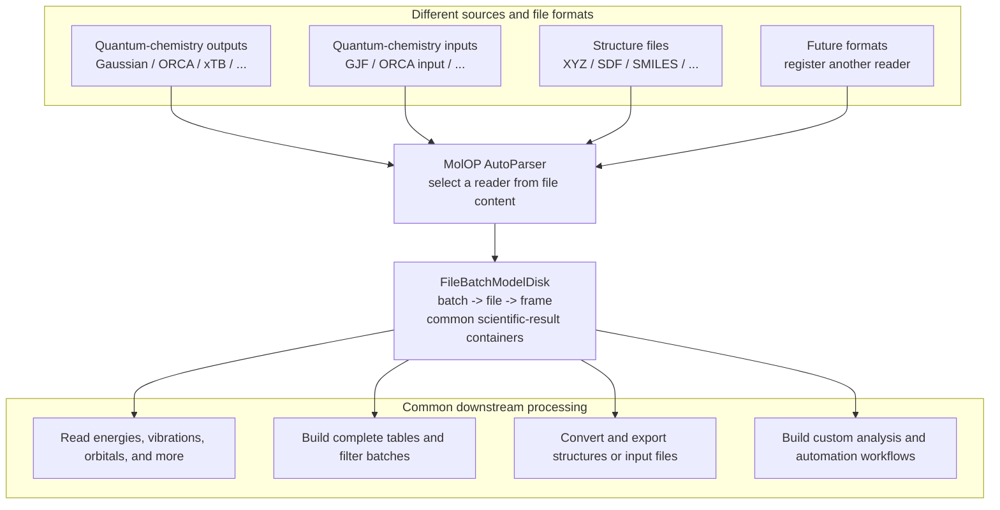

# MolOP

Give MolOP any supported computational-chemistry file. It detects the format from content and
normalizes the data into one `batch -> file -> frame` model. Format-specific logic stops at the
reader boundary; scientific results, complete tables, batch selection, structure conversion, and
automated workflows all use the same Python API and CLI.

See the [format overview](reference/format_support.md) for the current reader/writer coverage and
field boundaries.

## Choose a task

-   :material-download: **Install and verify**

    [Installation](getting_started/installation.md){ .md-button }

-   :material-language-python: **Use the Python API**

    [5-minute start](getting_started/quickstart.md){ .md-button }

-   :material-console: **Use the CLI**

    [CLI first steps](getting_started/cli.md){ .md-button }

-   :material-table: **Export a result table**

    [Batch summaries](guides/batch.md){ .md-button }

-   :material-share-variant: **Recover a molecular graph**

    [Structure recovery](guides/structure-recovery.md){ .md-button }

| Task | Start here |
| --- | --- |
| Install and verify the environment | [Installation](getting_started/installation.md) |
| Parse a real file for the first time | [5-minute start](getting_started/quickstart.md) |
| Read energies, frequencies, populations, or NMR data | [Read calculation results](guides/results.md) |
| Export a batch summary to CSV | [Batch summaries](guides/batch.md) |
| Select normal, optimized, or transition-state jobs | [Filter and select](guides/filtering.md) |
| Recover a metal-complex graph from coordinates | [Structure recovery](guides/structure-recovery.md) |
| Export XYZ, SDF, Gaussian, or ORCA inputs | [Convert and export](guides/conversion.md) |
| Check what a format can provide | [Format overview](reference/format_support.md) |

## Common inputs

MolOP currently provides dedicated readers or writers for Gaussian log/fchk/input, ORCA output/input, xTB
output, XYZ, SDF/MOL, SMILES, CML, and related formats. Use the
[format overview](reference/format_support.md) and individual format pages for exact fields and
limitations.

MolOP does not run Gaussian, ORCA, or xTB calculations. It reads existing files and turns their
contents into queryable and exportable objects.

## Next step

[Install MolOP](getting_started/installation.md), then follow the
[5-minute start](getting_started/quickstart.md).
