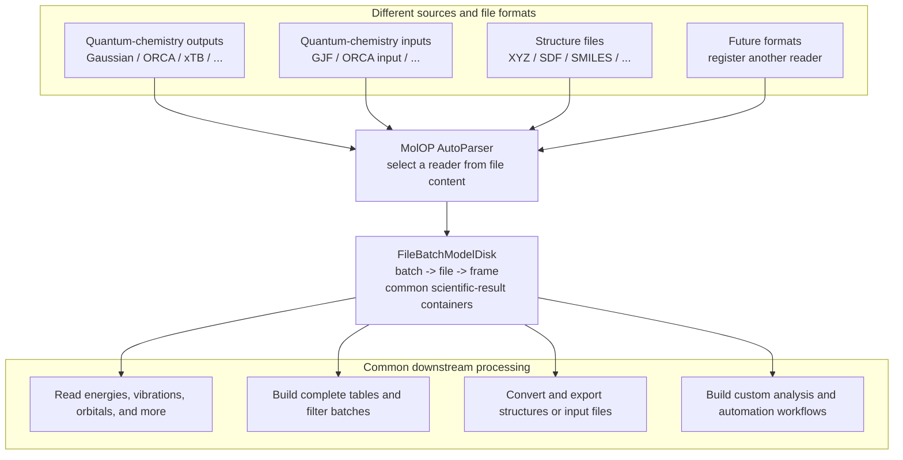

# MolOP

MolOP is a Python library and command-line tool for computational chemistry files. It reads existing
Gaussian, ORCA, xTB, and structure files, detects their formats, and maps them into a common
`batch -> file -> frame` object model.

MolOP does not run quantum-chemistry calculations. It reads calculation results, supports batch
filtering and summaries, converts structures, and provides an automation-friendly API.

## Data-flow overview



<div class="grid cards" markdown>

-   :material-download: **Start here**

    Install MolOP and run a working example.

    [Install and verify](getting_started/installation.md){ .md-button }

-   :material-language-python: **Use Python**

    Read results, build summaries, and export structures.

    [5-minute start](getting_started/quickstart.md){ .md-button }

-   :material-console: **Use the CLI**

    Chain parsing, filtering, and export from the shell.

    [CLI first steps](getting_started/cli.md){ .md-button }

-   :material-book-open-variant: **Look up details**

    Find formats, fields, configuration, and API members.

    [Reference](reference/index.md){ .md-button }

</div>

## Smallest runnable workflow

```python
from molop import AutoParser

batch = AutoParser("water_mp2.out", n_jobs=1)
frame = batch[0][-1]

print(batch[0].detected_format_id)
print(frame.energies.total_energy.m_as("hartree"))
```

??? example "Output"

    ```text
    orcaout
    -74.999374598107
    ```

Use the bundled [ORCA water example](../assets/examples/water_mp2.out). Results are exposed through
common fields; missing values remain `None` instead of being synthesized from absent source data.

## Choose by task

| Goal | Recommended entry |
| --- | --- |
| Read one file or a batch | [Parse files](guides/parsing.md) |
| Read energies, thermochemistry, vibrations, orbitals, or NMR | [Read calculation results](guides/results.md) |
| Build CSV/JSON summary tables | [Batch summaries](guides/batch.md) |
| Select normal, optimized, or transition-state results | [Filter and select](guides/filtering.md) |
| Export XYZ, SDF, Gaussian, or ORCA input | [Convert and export](guides/conversion.md) |
| Recover a molecular graph from coordinates | [Structure recovery](guides/structure-recovery.md) |
| Diagnose paths, formats, or native-library issues | [Troubleshooting](guides/troubleshooting.md) |
| Tune logging, parallelism, or structure recovery | [Configuration](reference/config.md) |

## Supported scope

MolOP provides readers or writers for Gaussian log/fchk/input, ORCA output/input, xTB output, XYZ,
SDF/MOL, SMILES, and CML-related workflows. See the [format overview](reference/format_support.md)
for exact fields, targets, and information boundaries.

## Core data model

```text
input path or glob -> AutoParser -> batch -> file -> frame
                                      |       |
                                batch operations  one structure and result snapshot
```

Read [Core concepts](getting_started/concepts.md) for object levels, frame selection, and lazy structure recovery.

## Next step

Start with [Install and verify](getting_started/installation.md), or go directly to the
[5-minute start](getting_started/quickstart.md) when an input file is ready.
