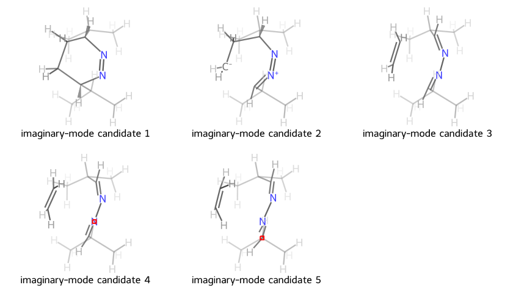
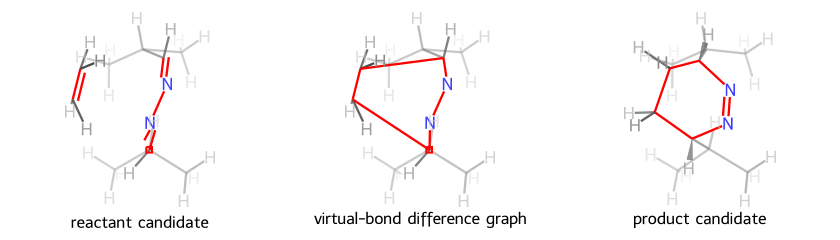
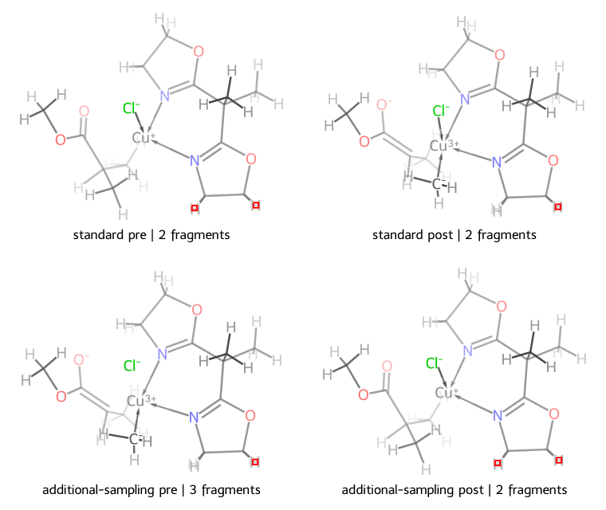

# Transition-state analysis

Use this workflow for frequency outputs that contain a transition-state candidate. MolOP can select
candidate frames, inspect imaginary modes, and generate geometry-based endpoint candidates. It does
not optimize those structures or certify a reaction path.

## Select candidate frames

```python
from molop import AutoParser

batch = AutoParser("results/*.log")
normal = batch.filter_state("normal", n_jobs=-1)
ts_batch = normal.filter_state("ts", n_jobs=-1)

print("parsed:", len(batch))
print("normal:", len(normal))
print("transition-state files:", len(ts_batch))
```

??? example "Selection result (input-dependent)"

    ```text
    parsed: <count>
    normal: <count>
    transition-state files: <count>
    ```

The counts depend on the input directory. A file can contain several frames, so select the actual TS
frame rather than assuming that `parsed_file[-1]` is the one selected by `filter_state("ts")`:

```python
for parsed_file in ts_batch:
    for frame in parsed_file:
        if frame.is_TS:
            imaginary = frame.vibrations.num_imaginary if frame.vibrations else None
            print(parsed_file.filename, frame.frame_id, imaginary)
```

??? example "Candidate-frame output shape (input-dependent)"

    ```text
    <source filename> <frame_id> <imaginary-mode count or None>
    ```

`is_TS` is a programmatic candidate decision. `None` means that the source did not provide enough
evidence and is different from `False`.

## Inspect the imaginary mode

```python
ts_frame = next(
    (frame for parsed_file in ts_batch for frame in parsed_file if frame.is_TS),
    None,
)
if ts_frame is None:
    raise ValueError("No transition-state frame was found in the input")
vibrations = ts_frame.vibrations

if vibrations is None:
    raise ValueError("The TS candidate has no structured frequency data")

print("imaginary modes:", vibrations.num_imaginary)
print("frequencies (cm^-1):", vibrations.frequencies.m_as("cm^-1"))
```

??? example "Imaginary-mode output (input-dependent)"

    ```text
    imaginary modes: <count>
    frequencies (cm^-1): <frequency array>
    ```

Review the frequency sign, displacement direction, and chemical interpretation. The number of
imaginary modes alone is not a reaction-path validation.

## Generate structures along the mode

`ts_vibration` displaces coordinates along the unique imaginary mode and returns candidate
`Molecule` objects. It requires `frame.is_TS` to be true and may omit geometries that violate basic
crowding checks:

```python
candidates = ts_frame.ts_vibration(ratio=1.75, steps=7)
print("candidate geometries:", len(candidates))
```

??? example "Imaginary-mode candidates (image output)"

    

    The image is generated from a real parsed frame with one imaginary mode. Each panel is a
    `ts_vibration(...)` candidate for which graph reconstruction succeeded. The two-dimensional
    layout compares connectivity; it is not an optimized reaction path.

## Render animations

Use `draw_animation(...)` on any parsed file to render its valid frames as a GIF or animated SVG.
This covers optimization, IRC, and scan trajectories. Frames that cannot reconstruct an RDKit graph
are skipped; rendering fails only when no frame is drawable. The default legend retains the original
frame ID, adds `TS` for transition-state frames, and includes total energy when available.

```python
trajectory = ts_batch[0]
trajectory.draw_animation(file_path="trajectory.gif", duration=120, size=(640, 480))
trajectory.draw_animation(
    image_format="svg",
    file_path="trajectory.svg",
    duration=120,
    size=(640, 480),
)
```

For a selected normal mode, use `draw_vibration_animation(...)`; the TS-specific method selects the
unique imaginary mode automatically. Their default legends include the mode index, frequency, and
candidate position. Pass `legends=[...]` to either method to supply labels explicitly.

```python
ts_frame.draw_vibration_animation(vibration_id=0, file_path="mode-0.gif", steps=9)
ts_frame.draw_ts_vibration_animation(file_path="ts-imaginary-mode.gif", steps=9)
```

## Infer endpoint candidates and bond changes

```python
try:
    reactant, product = ts_frame.possible_pre_post_ts(show_3D=True)
    print(reactant.GetNumAtoms(), product.GetNumAtoms())
except ValueError as exc:
    print("endpoint inference failed:", exc)

difference = ts_frame.to_diff_rdmol()
if difference is not None:
    print("difference graph bonds:", difference.GetNumBonds())
```

??? example "Endpoint candidates and virtual-bond difference (image output)"

    

    Red highlights identify bonds that change between the endpoint candidates. The center panel
    comes from `to_diff_rdmol()`. Its zero-order bonds are MolOP's machine-readable difference
    markers; the generator promotes them to visible lines only in the drawing copy.

`possible_pre_post_ts` returns geometry-based endpoint candidates, not optimized reactant and product
structures. `to_diff_rdmol` can return `None` when no supported bond-breaking difference is inferred.
Review atom mapping, connectivity, and the original calculation before using either result in an
automated reaction workflow.

By default, endpoint inference samples eight amplitudes on each side of the imaginary mode from
`min_ratio=0.6` to `max_ratio=1.4`, evenly spaced in harmonic-oscillator potential energy. It votes for the most frequent reconstructed
topology separately in the negative and positive displacement spaces, retaining the
largest-amplitude conformer for the winning topology. The candidate with more disconnected
fragments is returned as the precursor; equal fragment counts preserve negative-side then
positive-side order. Use `steps` to change the number of amplitudes sampled on each side.

The default `sampling_method` is `"harmonic_potential"`. To retain the original
linear-amplitude sampling, set `sampling_method="amplitude"` explicitly:

```python
reactant, product = ts_frame.possible_pre_post_ts(
    show_3D=True,
    sampling_method="amplitude",
)
```

The harmonic-potential method uses `a_i = sqrt(a_min**2 + i * (a_max**2 - a_min**2) / (steps - 1))`,
which spaces `a**2` and therefore the harmonic potential evenly. For an imaginary mode,
this corresponds to evenly spacing the magnitude of the potential-energy decrease away from
the saddle. The `"amplitude"` method preserves the original linear-amplitude sampling.
The default `"harmonic_potential"` method spaces potential energy evenly, while `"amplitude"`
preserves the original linear-amplitude behavior. The same option is available on `additional_pre_post_ts`, `save_pre_post_ts`, and
`to_diff_rdmol`.

The standard endpoint pair remains the primary result. For an additional representation, retain
the endpoint conformers and resample the atoms not incident to changed bonds while fixing the
changed atoms at their endpoint coordinates:

```python
standard_pre, standard_post = ts_frame.possible_pre_post_ts(show_3D=True)
additional_pre, additional_post = ts_frame.additional_pre_post_ts(standard_pre, standard_post)
```

When no bonds change between the standard endpoints, the additional sampling returns that same pair.

The following Notebook image compares the standard and additional-sampling results on a real TS frame.
Because the additional sampling fixes only atoms incident to changed bonds, rescanning the remaining atoms can recover
a different fragment topology in some cases:

??? example "Standard and additional-sampling endpoint representations (Notebook image output)"

    

    The top row contains the standard precursor and product; the bottom row contains the additional-sampling
    precursor and product. Each legend reports the fragment count. This pair is an additional representation
    and does not replace the standard endpoints.

Write the pair as XYZ (the default) or SDF files with `save_pre_post_ts(...)`. SDF retains the
reconstructed graph and the inferred three-dimensional conformer:

```python
pre_path, post_path = ts_frame.save_pre_post_ts("ts-endpoints", prefix="candidate")
sdf_pre_path, sdf_post_path = ts_frame.save_pre_post_ts(
    "ts-endpoints", prefix="candidate", format="sdf"
)
print(pre_path, post_path)
```

??? example "Endpoint file paths"

    ```text
    ts-endpoints/candidate_pre.xyz ts-endpoints/candidate_post.xyz
    ```

The files preserve the inferred three-dimensional candidate geometries. They are not optimized
reactant and product structures.

When `prefix` is omitted, disk-backed frames include the source filename stem and frame ID in the
generated names; memory-only frames fall back to `ts_frame_<id>`.

Call the same method on a parsed calculation file to export every TS frame. On a batch, each supported
calculation file receives a separate directory named with its complete filename stem. Files without
TS endpoint-export support are skipped with a warning. If source files in different directories have
the same stem, MolOP adds a stable source-path digest to keep their output directories distinct:

```python
file_endpoints = trajectory.save_pre_post_ts("ts-endpoints", format="sdf")
batch_endpoints = ts_batch.save_pre_post_ts("ts-endpoints-batch", format="sdf", n_jobs=4)
```

Both mappings are keyed by original frame ID; the batch mapping adds the source path as its outer key.

## Related operations

- Use `filter_state("opt")` and `parsed_file.closest_optimized_frame` for optimization trajectories.
- Use `frame.vibrate(...)` when a specific vibration, rather than the first one, is required.
- Export selected structures with [Convert and export](../guides/conversion.md).
