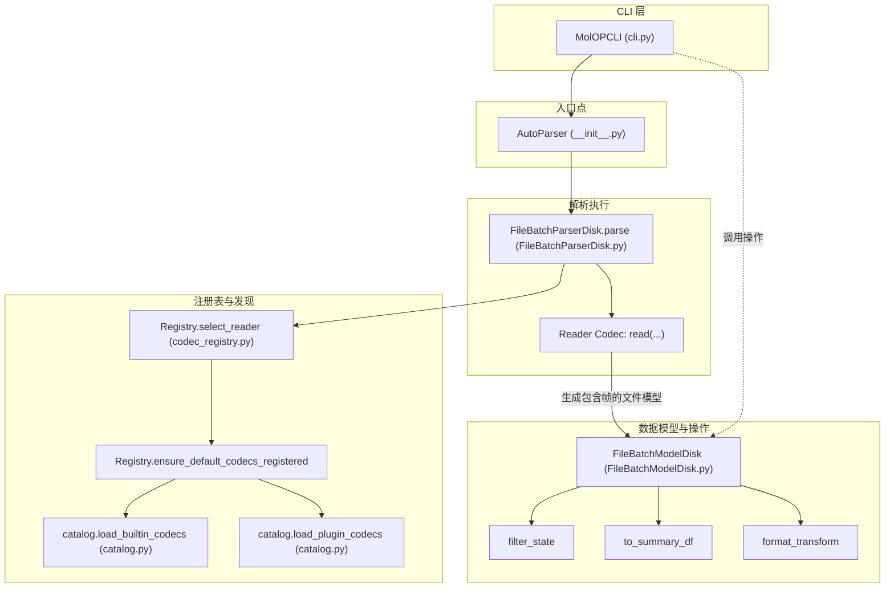

# 核心概念

本页介绍了 MolOP 的核心设计理念和架构组件。

## 1. 解析器与 AutoParser (Parsers)

MolOP 采用 **解析器/模型分离** 的设计模式。解析器负责从原始文本中提取数据。

- **AutoParser**: 这是推荐的用户入口函数。它能够根据文件扩展名自动识别并选择合适的解析器。
- **统一接口**: 无论是单个文件还是通配符匹配的多个文件，`AutoParser` 都能返回一致的批处理模型对象。

## 2. 数据模型 (Models)

MolOP 的所有数据模型都基于 **Pydantic** 构建，这为计算化学数据带来了以下优势：

- **类型安全**: 提供完善的类型提示，方便 IDE 补全和静态检查。
- **结构化数据**: 将复杂的计算输出（如 Gaussian log）转化为易于访问的 Python 对象。
- **多层级结构**:
  - `File`: 代表一个完整的物理文件。
  - `Frame`: 代表文件中的一个“帧”（如优化过程中的某一步）。

## 3. 注册表与编解码器 (Registry & Codecs)

MolOP 拥有高度可扩展的插件式架构：

- **延迟加载 (Lazy Registration)**: 编解码器（读写逻辑）仅在首次调用 `AutoParser` 或显式触发时才进行注册，这保证了库的导入速度。
- **解耦设计**: 新的 IO 格式可以通过在特定目录下添加 `register` 函数来轻松集成，无需修改核心代码。
- **第三方支持**: 支持通过 Python entry points 注册外部编解码器。

## 4. 批处理 (Batch Processing)

针对大规模计算任务，MolOP 提供了强大的批处理支持：

- **FileBatchModelDisk**: 一个类似字典的容器，用于管理成百上千个文件模型。
- **并行加速**: 内置多进程支持（`n_jobs` 参数），能够充分利用多核 CPU 提升解析效率。
- **链式操作**: 支持在批处理对象上直接进行过滤（`filter_state`）、转换（`format_transform`）和汇总（`summary`）。

## 5. 解析数据流

下图展示了 MolOP 解析流水线的数据流，从 CLI 或 API 入口点到最终的批处理模型操作。

- **入口点**: `AutoParser` 是单文件和批处理文件解析的统一入口。
- **延迟发现**: 编解码器仅在需要时通过 `Registry` 进行发现和注册。
- **批处理操作**: `FileBatchModelDisk` 提供了诸如过滤和转换等高级操作，这些操作可以链式调用。
