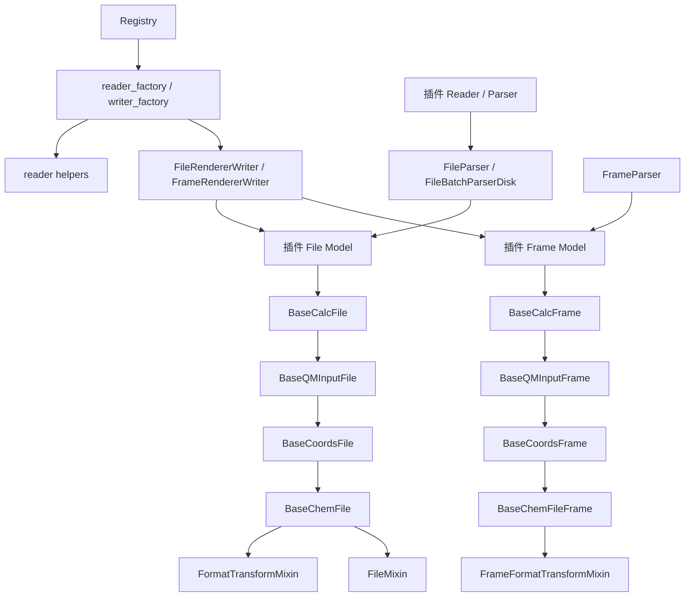
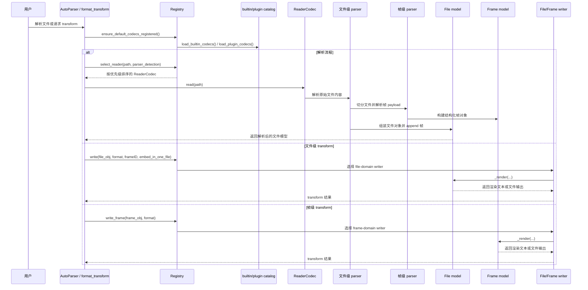

# 贡献指南

感谢你对 MolOP 的关注！我们欢迎各种形式的贡献。

- **报告 Bug**：如何提交有效的 Issue。
- **提交功能建议**：分享你对 MolOP 的改进想法。
- **代码贡献流程**：从 Fork 到 Pull Request 的详细步骤。
- **开发环境搭建**：如何配置本地开发环境。
- **代码风格规范**：遵循 Ruff 和类型检查要求。
- **文档规范**：使用统一的四层文档标准（`style_guide.md`）。

## 文档质量保证

为了确保高质量的文档，我们执行以下政策：

- **CI 验证**：每个 Pull Request 都会触发使用 `mkdocs build --strict` 的文档构建。这确保了没有损坏的内部链接和有效的配置。
- **翻译政策**：
  - 我们使用 `TODO(translate):` 作为中英文之间尚未翻译内容的占位符。
  - 占位符允许存在于 `main` 分支和 Pull Request 中，以实现阶段性同步。
  - **发布阻断**：发布标签（`v*`）中严禁出现占位符。如果在发布构建期间检测到任何占位符，CI 将失败。
- **Notebooks**：文档中的 Jupyter notebook 是可选的，且不会由 CI 执行。如果你希望输出可见，请确保它们已预先执行。

## 开发 IO 插件

MolOP 的 IO 栈刻意分成三层：**解析（parsing）**、**存储（storage）**、**注册（registration）**。开发插件时，最重要的原则就是保持这三层职责清晰，而不是把解析、数据模型和渲染全部塞进一个类里。

### 设计原则

- **文件模型负责帧集合与文件级转换**：`BaseChemFile` 本身是一个 `Sequence`，保存文件级元数据（如 `charge`、`multiplicity`、`file_content`），并通过 `FormatTransformMixin` 提供文件级 `format_transform(...)`。多帧选择、`embed_in_one_file` 等行为都应放在这里。
- **帧模型负责单结构数据与单帧渲染**：`BaseChemFileFrame` 保存 `frame_id`、`frame_content` 以及 `prev` / `next` 链接。`BaseQMInputFrame`、`BaseCalcFrame` 等子类继续补充 QM 元数据、能量、振动等属性。
- **优先保留原始文本，再做规范化**：文件和帧模型都应尽量同时保留原始文本与解析后的结构化字段。这对 round-trip、调试以及像 Gaussian fakeG 这类格式特定渲染非常重要。
- **渲染必须遵守 domain 语义**：文件级转换走 `codec_registry.write(...)`，帧级转换走 `codec_registry.write_frame(...)`。不要把帧包成单帧文件来伪装文件渲染；如果某种格式只对全文有意义，也不要暴露帧级 writer。

相关运行时代码：

- `src/molop/io/base_models/ChemFile.py`
- `src/molop/io/base_models/ChemFileFrame.py`
- `src/molop/io/base_models/Mixins.py`
- `src/molop/io/base_models/_format_transform.py`
- `src/molop/io/codec_registry.py`

### 插件类必须实现的行为

当你新增 parser 或 renderer 插件时，下面这些就是插件在 MolOP 中真正可用所必须具备的行为。

- **插件模块必须暴露 `register(registry)`。** builtin 与第三方 codec 的发现都依赖这个函数。
- **Reader 插件必须至少注册一个 `Registry.reader_factory(...)` 条目。** 对应 reader 需要能通过 `read(...)` 路径返回解析后的文件对象。
- **如果插件注册 file-domain writer，那么文件模型必须实现 `FileMixin._render_frames_in_one_file(...)`。** 这是 `embed_in_one_file=True` 时的标准入口。
- **如果插件注册 file-domain writer，那么文件模型必须实现 `FileMixin._render_frames(...)`。** 这是需要逐帧输出时的标准入口。
- **如果插件注册 `domain="frame"`，那么帧模型必须实现 `frame._render(**kwargs)`。** `FrameRendererWriter` 依赖 frame 类自己定义单帧渲染语义。
- **如果格式只支持全文语义，就必须只注册 `domain="file"`。** 如果没有合法的单帧语义，就不要额外增加 frame writer。
- **如果原始格式里有重要的指令或输出区块，插件应尽量保留 raw text。** 这样才能支持 round-trip 和格式特定渲染。

参考实现：

- 同时支持 file/frame 渲染：`src/molop/io/logic/coords_models/XYZFile.py` 与 `src/molop/io/logic/coords_frame_models/XYZFileFrame.py`
- 仅文件渲染：`src/molop/io/logic/QM_models/G16LogFile.py`
- reader 注册：`src/molop/io/logic/qminput_parsers/GJFFileParser.py`

### 最小插件示例

下面的例子展示了一个同时支持 file 和 frame 渲染的最小可用插件骨架。如果你的格式只支持全文输出，那么就像 `G16LogFile.py` 里的 fakeG 一样，直接省略 frame writer factory。

```python
from __future__ import annotations

from collections.abc import Sequence
from typing import TYPE_CHECKING, cast

from molop.io.base_models.ChemFile import BaseCoordsFile
from molop.io.base_models.ChemFileFrame import BaseCoordsFrame, _HasCoords
from molop.io.base_models.Mixins import (
    DiskStorageMixin,
    FileMixin,
    MemoryStorageMixin,
    _HasRenderableFrames,
)

if TYPE_CHECKING:
    from molop.io.codec_registry import Registry


class MyFmtFrameMixin:
    def _render(self, **kwargs) -> str:
        typed_self = cast(_HasCoords, self)
        return "\n".join(
            [
                str(len(typed_self.atoms)),
                f"charge {typed_self.charge} multiplicity {typed_self.multiplicity}",
                *(
                    f"{atom} {x:.6f} {y:.6f} {z:.6f}"
                    for atom, (x, y, z) in zip(
                        typed_self.atom_symbols,
                        typed_self.coords.m,
                        strict=True,
                    )
                ),
            ]
        )


class MyFmtFrameMemory(MemoryStorageMixin, MyFmtFrameMixin, BaseCoordsFrame["MyFmtFrameMemory"]): ...
class MyFmtFrameDisk(DiskStorageMixin, MyFmtFrameMixin, BaseCoordsFrame["MyFmtFrameDisk"]): ...


class MyFmtFileMixin(FileMixin):
    def _render_frames_in_one_file(self, frameID: Sequence[int], **kwargs) -> str:
        typed_self = cast(_HasRenderableFrames, self)
        return "\n\n".join(
            frame._render(**kwargs) for frame in typed_self.frames if frame.frame_id in frameID
        )

    def _render_frames(self, frameID: Sequence[int], **kwargs) -> list[str]:
        typed_self = cast(_HasRenderableFrames, self)
        return [
            frame._render(**kwargs) for frame in typed_self.frames if frame.frame_id in frameID
        ]


class MyFmtFileMemory(MemoryStorageMixin, MyFmtFileMixin, BaseCoordsFile[MyFmtFrameMemory]): ...
class MyFmtFileDisk(DiskStorageMixin, MyFmtFileMixin, BaseCoordsFile[MyFmtFrameDisk]): ...


def register(registry: Registry) -> None:
    from molop.io.codecs._shared.writer_helpers import (
        FileRendererWriter,
        FrameRendererWriter,
        StructureLevel,
    )

    @registry.writer_factory(
        format_id="myfmt",
        required_level=StructureLevel.COORDS,
        domain="file",
        default_graph_policy="coords",
        priority=100,
    )
    def _file_writer():
        return FileRendererWriter(
            format_id="myfmt",
            required_level=StructureLevel.COORDS,
            file_cls=MyFmtFileDisk,
            frame_cls=MyFmtFrameDisk,
            priority=100,
        )

    @registry.writer_factory(
        format_id="myfmt",
        required_level=StructureLevel.COORDS,
        domain="frame",
        default_graph_policy="coords",
        priority=100,
    )
    def _frame_writer():
        return FrameRendererWriter(
            format_id="myfmt",
            required_level=StructureLevel.COORDS,
            frame_cls=MyFmtFrameDisk,
            priority=100,
        )
```

### 数据结构依赖关系图

下图展示了插件开发时应尽量保持的依赖方向。基础 file/frame 模型定义存储与遍历语义，parser 负责填充这些模型，registry 与 writer helper 则在其上暴露 reader/writer 能力。



可以这样理解：

- 继承方向应从通用基类流向格式特定模型
- parser 依赖它要填充的模型，而不是反过来
- 注册层依赖 factory，而不是在核心运行时里硬编码具体插件实现
- 文件级 writer 可以同时依赖 file 和 frame 类；帧级 writer 则应只依赖单帧语义

### 运行时数据流时序图

下图总结了解析与渲染在运行时的顺序。新增 codec 或插件时，应尽量保持这一时序不变。



插件开发的经验法则是：把逻辑放在“最早且最稳定的拥有者”那一层。解析属于 parser 模块，文件装配属于 file model，单帧语义属于 frame model，而用户可见的能力暴露属于 registry 注册层。

### 基类已经提供的能力

#### 文件模型

优先复用现有文件基类：

- `BaseCoordsFile`：坐标格式
- `BaseQMInputFile`：输入文件格式（坐标 + route/resource 元数据）
- `BaseCalcFile`：计算结果格式（坐标 + QM 元数据 + 输出属性）

这些基类已经提供：

- 可重复迭代的 `Sequence` 容器行为
- `append(...)`、`frames`、`__getitem__`、`__iter__`
- 汇总接口（`to_summary_dict`、`to_summary_df`）
- 原始文件内容释放（`release_file_content`）
- 文件级 `format_transform(...)`

如果你的文件模型需要通过通用 registry 路径参与渲染，就必须实现 `FileMixin` 约定的两个方法：

- `_render_frames_in_one_file(frameID, **kwargs) -> str`
- `_render_frames(frameID, **kwargs) -> list[str]`

参考实现：

- `src/molop/io/logic/qminput_models/GJFFile.py`
- `src/molop/io/logic/QM_models/G16LogFile.py`

#### 帧模型

根据数据层级选择帧基类：

- `BaseCoordsFrame`
- `BaseQMInputFrame`
- `BaseCalcFrame`

这些基类已经提供：

- 帧身份（`frame_id`）
- 帧间链接（`prev`、`next`）
- 原始帧文本保存（`frame_content`）
- 继承自 `Molecule` 的分子级能力
- 当目标格式存在 frame writer 时可直接使用的帧级 `format_transform(...)`

帧模型应只负责单帧语义；文件装配、多帧合并、帧选择等行为应留在文件模型层。

### 解析与存储约定

- **Parser 负责构建模型，模型不应在运行时重新解析文件**。
- **尽量保留原始 route / resources / title 等文本**，而不是只保留派生语义值。
- **优先用模型 validator 做字段规范化和聚合**，不要把重要逻辑散落在外部脚本里。
- **容器必须可重复遍历且无共享游标状态**，不要把迭代器语义混进文件/帧集合。

### 新格式的注册规范

新的 reader / writer 只有在模块暴露 `register(registry)` 函数之后，才会被 builtin codec loader 延迟注册。

对于 reader：

- 使用 `Registry.reader_factory(...)`
- 声明 format id、extensions、priority
- 解析逻辑放在 `src/molop/io/logic/*_parsers`

对于 writer / renderer：

- 使用 `Registry.writer_factory(...)`
- 明确选择 `domain`：
  - `domain="file"`：文件级 writer
  - `domain="frame"`：帧级 writer
- 文件级使用 `FileRendererWriter`
- 帧级使用 `FrameRendererWriter`
- 正确设置 `required_level`：
  - `StructureLevel.COORDS`
  - `StructureLevel.GRAPH`
- `default_graph_policy` 要有意识地指定，不要依赖猜测

参考注册文件：

- `src/molop/io/logic/qminput_models/GJFFile.py`
- `src/molop/io/logic/coords_models/XYZFile.py`
- `src/molop/io/logic/QM_models/G16LogFile.py`

### 仅文件支持 vs 同时支持帧

并不是每种格式都应该同时支持文件级和帧级转换。

- 如果某种格式只在全文语义下成立（例如伪造的多帧 Gaussian log），就只注册 `domain="file"`。
- 如果格式天然支持单帧输出，再单独增加 `domain="frame"`。
- 如果未注册 frame writer，则 `frame.format_transform(...)` 抛出 `UnsupportedFormatError` 是正确行为。

### 需要同步的生成面

reader / writer 注册变化会影响生成的 typing 和 CLI surface，因此在同一工作会话里要同步检查或生成：

- `uv run python scripts/generate_io_typing_catalog.py`
- `uv run python scripts/generate_chemfile_format_transform_stubs.py`
- `uv run python scripts/generate_cli_transform_stubs.py`

推荐验证命令：

- `uv run pytest <targeted-test>`
- `uv run python scripts/generate_io_typing_catalog.py --check`
- `uv run python scripts/generate_chemfile_format_transform_stubs.py --check`
- `uv run python scripts/generate_cli_transform_stubs.py --check`

### 给插件作者的实用检查清单

在提交新的 parser / renderer 插件前，请确认：

1. 文件模型与帧模型职责分离清晰
2. 原始输入/输出文本在需要时被保留
3. 文件容器可以稳定重复遍历
4. 注册时 `domain` 选择正确
5. 仅文件格式不会意外暴露 frame writer
6. 生成的 stubs 与 CLI typing 已同步更新
7. 至少有一个有针对性的测试证明新格式确实可解析或可渲染
