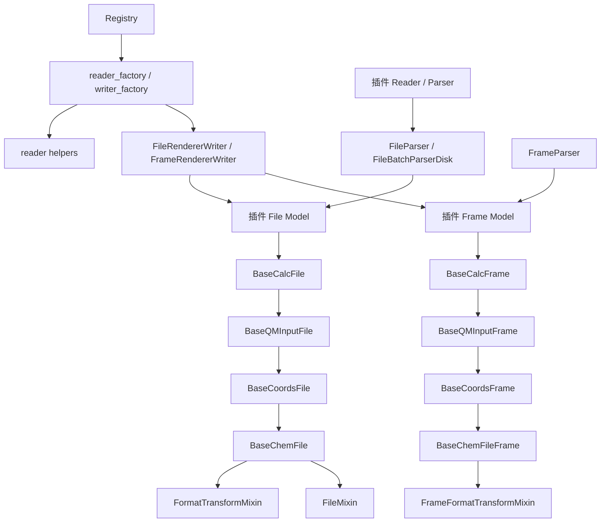
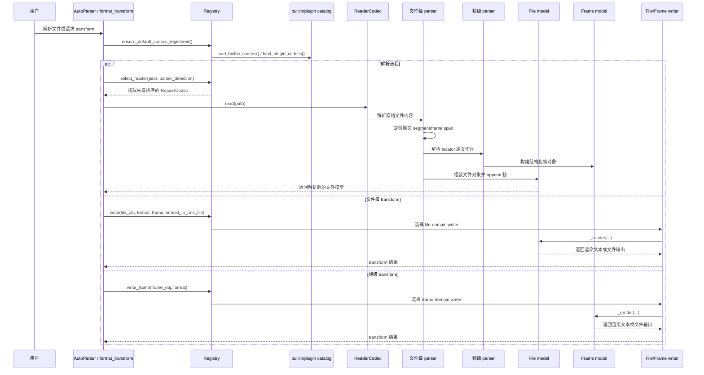

# 完整 Parser 契约

本页定义 MolOP reader、file/frame model、writer 和 codec registry 之间的实现边界，面向新增
格式或维护 IO 栈的贡献者。

## 文档质量保证

为了让实现、示例和双语页面保持可验证，我们执行以下约束：

- **CI 验证**：每个 Pull Request 都会触发使用 `mkdocs build --strict` 的文档构建。这确保了没有损坏的内部链接和有效的配置。
- **双语页面**：面向用户的中文和英文页面成对维护；发布前不得留下翻译占位符。
- **Markdown 输出**：打印值和生成的产物必须折叠。README 使用 `<details>`，MkDocs 页面使用
  Material `??? example`；详见[文档贡献](../contributing/documentation.md)。
- **Notebooks**：只编辑 Notebook 的代码单元和 Markdown 单元。CI 会在 MkDocs 构建前使用
  `nbconvert --execute` 执行全部代码单元，再由 `mkdocs-jupyter` 渲染保存的输出；不得手动修改
  `outputs` 或执行计数。

## 开发 IO 插件

MolOP 的 IO 栈刻意分成三层：**解析（parsing）**、**存储（storage）**、**注册（registration）**。开发插件时，最重要的原则就是保持这三层职责清晰，而不是把解析、数据模型和渲染全部塞进一个类里。

### 设计原则

- **文件模型负责帧集合与文件级转换**：`BaseChemFile` 本身是一个 `Sequence`，保存文件级元数据（如 `charge`、`multiplicity`、`file_content`），并通过 `FormatTransformMixin` 提供文件级 `format_transform(...)`。多帧选择、`embed_in_one_file` 等行为都应放在这里。
- **帧模型负责单结构数据与单帧渲染**：`BaseChemFileFrame` 保存 `frame_id`、`frame_content` 以及 `prev` / `next` 链接。`BaseQMInputFrame`、`BaseCalcFrame` 等子类继续补充 QM 元数据、能量、振动等属性。
- **优先保留原始文本，再做规范化**：文件和帧模型都应尽量同时保留原始文本与解析后的结构化字段。这对 round-trip、调试以及像 Gaussian fakeG 这类格式特定渲染非常重要。
- **渲染必须遵守 domain 语义**：文件级转换走 `codec_registry.write(...)`，帧级转换走 `codec_registry.write_frame(...)`。不要把帧包成单帧文件来伪装文件渲染；如果某种格式只对全文有意义，也不要暴露帧级 writer。

相关运行时代码：

- `src/molop/io/base_models/ChemFile.py`
- `src/molop/io/base_models/ChemFileFrame.py`
- `src/molop/io/base_models/Mixins.py`
- `src/molop/io/base_models/_format_transform.py`
- `src/molop/io/codec_registry.py`

### 解析插件的最低契约

本节首先约束直接加入 MolOP 仓库、位于 `src/molop/io/logic/` 下的内置 reader。一个新格式的完整 reader 需要实现三个 parser 方法和一个模块级注册函数：

| 所属类 | 必需成员 | 职责 |
| --- | --- | --- |
| file parser mixin | `format_id` | 声明小写、去空格后的规范格式标识。 |
| file parser mixin | `_quick_check_file_format()` | 检查文件前部可用的稳定指纹；不执行完整解析。 |
| file parser mixin | `_locate_segments()` | 返回原文中所有 segment 及其 frame 的精确字符区间。 |
| frame parser mixin | `_parse_frame()` | 将一个 locator 原文切片解析成目标 frame model 的字段 mapping。 |
| `*FileParser.py` 模块 | `register(registry)` | 向 registry 注册 disk reader。 |

只计算 file parser 本身时是两个必需方法；把 frame parser 计算在内时，完整 reader 是三个必需方法。`register(registry)` 是模块集成函数，不是 parser 方法。

还必须完成以下类绑定，但不需要增加方法：

- disk file parser 声明 `allowed_formats`、`_frame_parser` 和 `_chem_file`
- disk frame parser 声明 `_file_frame_class_`
- 为格式选择 `BaseCoordsFile` / `BaseQMInputFile` / `BaseCalcFile` 及对应 frame 基类
- 格式专用数据直接定义在专用 file/frame model 上；parser 返回值的 key 必须与模型字段一致
- memory file/frame parser 不是 `AutoParser` 注册所必需的，但推荐提供，便于字符串解析和 locator 单元测试

不得实现或重新引入 `_split_file()`、`_parse_metadata()`。`_locate_segments()` 是 segment/frame 边界和送入 frame parser 的原文内容的唯一事实源。

#### Locator 约束

`_locate_segments()` 必须返回非空的 `Sequence[LocatedSourceSegment]`，并遵守以下规则：

- `LocatedTextBlock(start_char, end_char)` 使用原始 `file_content` 上的非空半开字符区间 `[start_char, end_char)`。
- segment 必须按原文顺序排列且互不重叠；每个 frame 必须完全包含在所属 segment 内，并在该 segment 内有序且互不重叠。
- segment 包含 frame 时，这些 frame 区间必须覆盖 segment 内全部非空白字符。允许纯空白间隙，例如 SMILES 记录之间的空行；零帧 segment 可以保留任意 job metadata。
- 不得先 `.strip()`、规范化换行或 split/rejoin 再计算区间。优先使用正则 `match.span()`，或 `splitlines(keepends=True)` 配合累计字符偏移。
- 普通多构象文件通常用“整个 artifact 一个 segment、内部多个 frame”；多 job 输入通常每个 job 一个 segment；计算输出通常每个 job 一个 segment、内部包含多个几何 frame。
- segment 可以没有 frame，例如没有打印坐标的计算 job；不得伪造空 frame 或把相邻 job 的坐标归入该 segment。
- 找不到合法 segment，或格式语义要求 frame 但未找到 frame 时，抛出 `FormatMismatchError` 或明确的解析错误；不得返回重建后的文本。

插件只返回字符区间，不自行创建 `SourceSpan`。基类使用同一次严格解码把字符区间转换为 byte/character/line span，并计算原文块 SHA-256。locator 始终参与解析；`capture_source_evidence` 只控制是否把 span 和 hash 写入输出模型。

`_quick_check_file_format()` 同时用于完整解析前检查和自动探测。自动探测默认只读取文件前 `20_000` 个字符，因此有稳定头部指纹时应在这里检查，并在不匹配时抛出 `FormatMismatchError`；不要依赖文件尾终止标志。没有廉价、稳定指纹的格式可以有意识地使用空实现，但 locator 或 frame extractor 必须最终拒绝不匹配内容。

#### 最小 reader 骨架

以下骨架假定 `MyFmtFileDisk`、`MyFmtFrameDisk` 以及格式专用 extractor 已经定义。复杂提取逻辑应放进 extractor 模块，不要堆积在 parser 类中。

```python
from __future__ import annotations

from collections.abc import Mapping, Sequence
from typing import TYPE_CHECKING, Any, ClassVar

from molop.io.base_models.FileParser import BaseFileParserDisk
from molop.io.base_models.FrameParser import BaseFrameParser, FrameParseContext
from molop.io.base_models.source import LocatedSourceSegment, LocatedTextBlock
from molop.io.codec_exceptions import FormatMismatchError
from molop.io.logic.myfmt.frame_models.MyFmtFrame import MyFmtFrameDisk
from molop.io.logic.myfmt.frame_parsers._myfmt_extractors import (
    extract_myfmt_frame_payload,
)
from molop.io.logic.myfmt.models.MyFmtFile import MyFmtFileDisk
from molop.io.logic.myfmt.parsers._myfmt_file_extractors import (
    has_myfmt_header,
    locate_myfmt_frames,
)

if TYPE_CHECKING:
    from molop.io.codec_registry import Registry


class MyFmtFrameParserMixin:
    def _parse_frame(
        self,
        block: str,
        *,
        context: FrameParseContext,
    ) -> Mapping[str, Any]:
        _ = context
        return extract_myfmt_frame_payload(block)


class MyFmtFrameParserDisk(MyFmtFrameParserMixin, BaseFrameParser[MyFmtFrameDisk]):
    _file_frame_class_ = MyFmtFrameDisk


class MyFmtFileParserMixin:
    format_id: ClassVar[str] = "myfmt"

    @classmethod
    def _quick_check_file_format(cls, file_content: str) -> None:
        if not has_myfmt_header(file_content):
            raise FormatMismatchError("Not a myfmt file.")

    def _locate_segments(
        self,
        file_content: str,
    ) -> Sequence[LocatedSourceSegment]:
        frames: tuple[LocatedTextBlock, ...] = locate_myfmt_frames(file_content)
        return (
            LocatedSourceSegment(
                segment=LocatedTextBlock(0, len(file_content)),
                frames=frames,
            ),
        )


class MyFmtFileParserDisk(
    MyFmtFileParserMixin,
    BaseFileParserDisk[MyFmtFileDisk, MyFmtFrameDisk, MyFmtFrameParserDisk],
):
    allowed_formats = (".myfmt",)
    _frame_parser = MyFmtFrameParserDisk
    _chem_file = MyFmtFileDisk


def register(registry: Registry) -> None:
    from molop.io.codecs._shared.reader_helpers import (
        ParserDiskReader,
        ReaderCodec,
        StructureLevel,
        extensions_for_parser,
    )

    extensions = frozenset(extensions_for_parser(MyFmtFileParserDisk))

    @registry.reader_factory(
        format_id=MyFmtFileParserDisk.format_id,
        extensions=extensions,
        priority=100,
    )
    def _reader() -> ReaderCodec:
        return cast(
            ReaderCodec,
            ParserDiskReader(
                format_id=MyFmtFileParserDisk.format_id,
                extensions=extensions,
                level=StructureLevel.COORDS,
                parser_cls=MyFmtFileParserDisk,
                priority=100,
            ),
        )
```

`StructureLevel.COORDS` 用于以原子和坐标为最低保证的 reader；只有能够保证合法分子图时才声明 `StructureLevel.GRAPH`。

#### 可选 file parser 钩子

| 钩子 | 适用场景 |
| --- | --- |
| `_parse_artifact_metadata()` | 软件名称、版本等对整个 artifact 生效的 metadata。 |
| `_parse_segment_metadata()` | route、运行时间、终止状态等单个 job/segment metadata。 |
| `_prepare_file_metadata()` | 聚合多个 segment 后生成文件级 metadata。 |
| `_postprocess_parsed_frame()` | frame append 前执行格式拥有的跨帧修正。 |
| `_source_frame_role()` | 标记 `initial`、`intermediate`、`terminal`、`single_point` 等 frame role。 |
| `_source_frame_fields()` | 填充 `coordinate_source` 等格式专用来源字段。 |
| `_update_file_metadata_from_frames()` | 在所有 frame 解析后，从首帧或末帧回填文件字段。 |

没有对应语义时不要覆盖这些钩子。文件级 metadata 只放 `_parse_artifact_metadata()`，segment-scoped metadata 只放 `_parse_segment_metadata()`；不要把终止状态等 segment 事实无条件复制成每帧事实。

`BaseFrameParser` 会把精确 frame 原文和不可变 `FrameParseContext` 传入 `_parse_frame(...)`。
文件级与 segment 级 metadata 应从 `context.additional_data` 读取，不要把当前 block 或 context
保存到 parser 实例。组装 frame 模型时会在格式 payload 之后应用 context metadata，因此字段冲突
由 context 值覆盖。

#### 内置与外部注册边界

- **MolOP 仓库内置格式**：将公开模块放在 `src/molop/io/logic/` 下，并以 `*File.py` 或 `*FileParser.py` 结尾；模块暴露 `register(registry)` 后，builtin catalog 会自动扫描并延迟注册。无需修改 MolOP 的 `pyproject.toml`，也不需要 entry point。
- **独立发行的第三方包**：不在 builtin 扫描范围内，必须通过其自身 `pyproject.toml` 的 `molop.codecs` entry point 暴露可调用的 `register(registry)`，除非宿主应用显式手工注册。

参考实现：

- 最小坐标 reader：`src/molop/io/logic/coords/parsers/XYZFileParser.py`
- 多 job 输入 locator：`src/molop/io/logic/gaussian/input/parsers/GJFFileParser.py`
- 多 segment 计算输出：`src/molop/io/logic/gaussian/log/parsers/G16LogFileParser.py`
- 第三方加载边界：`src/molop/io/codecs/catalog.py`

### Renderer 插件必须实现的行为

- **如果插件注册 file-domain writer，那么文件模型必须提供 `FileMixin` 的文件组合语义。** 默认实现会调用每个 frame 的 `_render()`；只有全文格式需要覆盖 `_render_frames_in_one_file(...)` 或 `_render_frames(...)`。
- **如果插件注册 `domain="frame"`，那么帧模型必须实现 `frame._render(**kwargs)`。** `FrameRendererWriter` 依赖 frame 类自己定义单帧渲染语义。
- **如果格式只支持全文语义，就必须只注册 `domain="file"`。** 如果没有合法的单帧语义，就不要额外增加 frame writer。
- **如果原始格式里有重要的指令或输出区块，插件应尽量保留 raw text。** 这样才能支持 round-trip 和格式特定渲染。

### 最小 renderer 示例

下面的例子展示了一个同时支持 file 和 frame 渲染的最小可用插件骨架。如果你的格式只支持全文输出，那么就像 `G16LogFile.py` 里的 fakeG 一样，直接省略 frame writer factory。

```python
from __future__ import annotations

from collections.abc import Sequence
from typing import TYPE_CHECKING, cast

from molop.io.base_models.ChemFile import BaseCoordsFile
from molop.io.base_models.ChemFileFrame import BaseCoordsFrame, _HasCoords
from molop.io.base_models.Mixins import (
    DiskStorageMixin,
    FileMixin,
    MemoryStorageMixin,
    _HasRenderableFrames,
)

if TYPE_CHECKING:
    from molop.io.codec_registry import Registry


class MyFmtFrameMixin:
    def _render(self, **kwargs) -> str:
        typed_self = cast(_HasCoords, self)
        return "\n".join(
            [
                str(len(typed_self.atoms)),
                f"charge {typed_self.charge} multiplicity {typed_self.multiplicity}",
                *(
                    f"{atom} {x:.6f} {y:.6f} {z:.6f}"
                    for atom, (x, y, z) in zip(
                        typed_self.atom_symbols,
                        typed_self.coords.m,
                        strict=True,
                    )
                ),
            ]
        )


class MyFmtFrameMemory(MemoryStorageMixin, MyFmtFrameMixin, BaseCoordsFrame["MyFmtFrameMemory"]): ...
class MyFmtFrameDisk(DiskStorageMixin, MyFmtFrameMixin, BaseCoordsFrame["MyFmtFrameDisk"]): ...


class MyFmtFileMixin(FileMixin):
    def _render_frames_in_one_file(self, frame_ids: Sequence[int], **kwargs) -> str:
        typed_self = cast(_HasRenderableFrames, self)
        return "\n\n".join(
            frame._render(**kwargs)
            for frame in typed_self.frames
            if frame.frame_id in frame_ids
        )

    def _render_frames(self, frame_ids: Sequence[int], **kwargs) -> list[str]:
        typed_self = cast(_HasRenderableFrames, self)
        return [
            frame._render(**kwargs)
            for frame in typed_self.frames
            if frame.frame_id in frame_ids
        ]


class MyFmtFileMemory(MemoryStorageMixin, MyFmtFileMixin, BaseCoordsFile[MyFmtFrameMemory]): ...
class MyFmtFileDisk(DiskStorageMixin, MyFmtFileMixin, BaseCoordsFile[MyFmtFrameDisk]): ...


def register(registry: Registry) -> None:
    from molop.io.codecs._shared.writer_helpers import (
        FileRendererWriter,
        FrameRendererWriter,
        StructureLevel,
    )

    @registry.writer_factory(
        format_id="myfmt",
        required_level=StructureLevel.COORDS,
        domain="file",
        default_graph_policy="coords",
        priority=100,
    )
    def _file_writer():
        return FileRendererWriter(
            format_id="myfmt",
            required_level=StructureLevel.COORDS,
            file_cls=MyFmtFileDisk,
            frame_cls=MyFmtFrameDisk,
            priority=100,
        )

    @registry.writer_factory(
        format_id="myfmt",
        required_level=StructureLevel.COORDS,
        domain="frame",
        default_graph_policy="coords",
        priority=100,
    )
    def _frame_writer():
        return FrameRendererWriter(
            format_id="myfmt",
            required_level=StructureLevel.COORDS,
            frame_cls=MyFmtFrameDisk,
            priority=100,
        )
```

### 数据结构依赖关系图

下图展示了插件开发时应尽量保持的依赖方向。基础 file/frame 模型定义存储与遍历语义，parser 负责填充这些模型，registry 与 writer helper 则在其上暴露 reader/writer 能力。



可以这样理解：

- 继承方向应从通用基类流向格式特定模型
- parser 依赖它要填充的模型，而不是反过来
- 注册层依赖 factory，而不是在核心运行时里硬编码具体插件实现
- 文件级 writer 可以同时依赖 file 和 frame 类；帧级 writer 则应只依赖单帧语义

### 运行时数据流时序图

下图总结了解析与渲染在运行时的顺序。新增 codec 或插件时，应尽量保持这一时序不变。



插件开发的经验法则是：把逻辑放在“最早且最稳定的拥有者”那一层。解析属于 parser 模块，文件装配属于 file model，单帧语义属于 frame model，而用户可见的能力暴露属于 registry 注册层。

### 基类已经提供的能力

#### 文件模型

优先复用现有文件基类：

- `BaseCoordsFile`：坐标格式
- `BaseQMInputFile`：输入文件格式（坐标 + route/resource 元数据）
- `BaseCalcFile`：计算结果格式（坐标 + QM 元数据 + 输出属性）

这些基类已经提供：

- 可重复迭代的 `Sequence` 容器行为
- `append(...)`、`frames`、`__getitem__`、`__iter__`
- 汇总接口（`to_summary_dict`、`to_summary_df`）
- 原始文件内容释放（`release_file_content`）
- 文件级 `format_transform(...)`

如果你的文件模型需要通过通用 registry 路径参与渲染，就必须实现 `FileMixin` 约定的两个方法：

- `_render_frames_in_one_file(frame_ids, **kwargs) -> str`
- `_render_frames(frame_ids, **kwargs) -> list[str]`

参考实现：

- `src/molop/io/logic/gaussian/input/models/GJFFile.py`
- `src/molop/io/logic/gaussian/log/models/G16LogFile.py`

#### 帧模型

根据数据层级选择帧基类：

- `BaseCoordsFrame`
- `BaseQMInputFrame`
- `BaseCalcFrame`

这些基类已经提供：

- 帧身份（`frame_id`）
- 帧间链接（`prev`、`next`）
- 原始帧文本保存（`frame_content`）
- 继承自 `Molecule` 的分子级能力
- 当目标格式存在 frame writer 时可直接使用的帧级 `format_transform(...)`

帧模型应只负责单帧语义；文件装配、多帧合并、帧选择等行为应留在文件模型层。

### 解析与存储约定

- **Parser 负责构建模型，模型不应在运行时重新解析文件**。
- **尽量保留原始 route / resources / title 等文本**，而不是只保留派生语义值。
- **优先用模型 validator 做字段规范化和聚合**，不要把重要逻辑散落在外部脚本里。
- **容器必须可重复遍历且无共享游标状态**，不要把迭代器语义混进文件/帧集合。

### 新格式的注册规范

新的 reader / writer 只有在模块暴露 `register(registry)` 函数之后，才会被 builtin codec loader 延迟注册。Builtin codec loader 会递归扫描 `src/molop/io/logic` 下公开的 `*File.py` 和 `*FileParser.py` 模块，不需要为新增格式维护固定目录列表。

这里描述的是 MolOP 仓库内置格式。它们不需要在 `pyproject.toml` 中声明 `molop.codecs` entry point。entry point 仅用于 builtin 扫描范围之外、作为独立 Python 包安装的第三方插件。

对于 reader：

- 使用 `Registry.reader_factory(...)`
- 声明 format id、extensions、priority
- 解析逻辑放在 `src/molop/io/logic` 下对应格式包的 parser 模块中

对于 writer / renderer：

- 使用 `Registry.writer_factory(...)`
- 明确选择 `domain`：
    - `domain="file"`：文件级 writer
    - `domain="frame"`：帧级 writer
- 文件级使用 `FileRendererWriter`
- 帧级使用 `FrameRendererWriter`
- 正确设置 `required_level`：
    - `StructureLevel.COORDS`
    - `StructureLevel.GRAPH`
- `default_graph_policy` 要有意识地指定，不要依赖猜测

参考注册文件：

- `src/molop/io/logic/gaussian/input/models/GJFFile.py`
- `src/molop/io/logic/coords/models/XYZFile.py`
- `src/molop/io/logic/gaussian/log/models/G16LogFile.py`

### 仅文件支持 vs 同时支持帧

并不是每种格式都应该同时支持文件级和帧级转换。

- 如果某种格式只在全文语义下成立（例如伪造的多帧 Gaussian log），就只注册 `domain="file"`。
- 如果格式天然支持单帧输出，再单独增加 `domain="frame"`。
- 如果未注册 frame writer，则 `frame.format_transform(...)` 抛出 `UnsupportedFormatError` 是正确行为。

### 需要同步的生成面

MolOP 内置 reader / writer 的注册变化会影响生成的 typing，因此在同一工作会话里要同步检查或生成：

- `uv run python scripts/generate_io_typing_catalog.py`
- `uv run python scripts/generate_chemfile_format_transform_stubs.py`

推荐验证命令：

- `uv run pytest <targeted-test>`
- `uv run python scripts/generate_io_typing_catalog.py --check`
- `uv run python scripts/generate_chemfile_format_transform_stubs.py --check`

### 给插件作者的实用检查清单

在提交新的 parser / renderer 插件前，请确认：

1. 文件模型与帧模型职责分离清晰
2. file parser 只实现 locator-only 生命周期，没有 `_split_file()` 或 `_parse_metadata()`
3. LF、CRLF、非 ASCII、多 frame 和 `only_last_frame` 测试验证了原文 slice、byte span 与 SHA-256
4. `_quick_check_file_format()` 只依赖探测前缀；有稳定指纹时以 `FormatMismatchError` 拒绝不匹配内容
5. 原始输入/输出文本在需要时被保留
6. 文件容器可以稳定重复遍历
7. 内置格式通过模块级 `register(registry)` 注册，没有不必要的 `pyproject.toml` entry point
8. writer 注册使用正确 `domain`，仅文件格式不会意外暴露 frame writer
9. 生成的 stubs 与 CLI typing 已同步更新
10. 至少有一个有针对性的测试证明新格式确实可解析或可渲染
