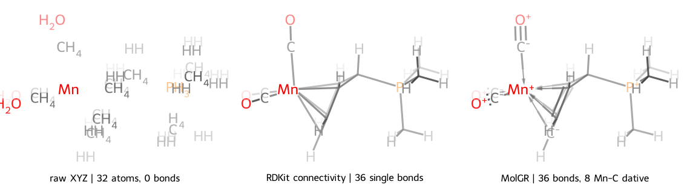

# 结构恢复

从元素、三维坐标、电荷和多重度恢复分子键、键级、形式电荷与自由基状态。

## 金属配合物示例

示例使用一个 Gaussian 16 单点计算：[下载 `mn_complex_sp.log`](../../assets/examples/mn_complex_sp.log)。
源文件没有分子图；第一次访问 `frame.rdmol` 时，MolOP 调用 MolGR 恢复拓扑。

```python
from rdkit import Chem

from molop import AutoParser

frame = AutoParser("mn_complex_sp.log", n_jobs=1)[0][-1]
mol = frame.rdmol

if mol is None:
    raise RuntimeError("结构恢复失败")

mn = next(atom for atom in mol.GetAtoms() if atom.GetSymbol() == "Mn")
dative_count = sum(bond.GetBondType() == Chem.BondType.DATIVE for bond in mol.GetBonds())

print(frame.formula)
print(f"{mol.GetNumAtoms()} atoms, {mol.GetNumBonds()} bonds")
print(f"Mn charge {mn.GetFormalCharge():+d}, degree {mn.GetDegree()}")
print(f"{dative_count} dative bonds")
print(frame.topology_reconstruction_backend, frame.topology_reconstruction_status)
```

??? example "真实输出与分子图"

    ```text
    C12H15MnO3P+
    32 atoms, 36 bonds
    Mn charge +1, degree 8
    8 dative bonds
    cpp succeeded
    ```

    

    | 处理方式 | 键数 | Mn 配位 | 结果 |
    | --- | ---: | --- | --- |
    | 原始 XYZ | 0 | 无 | 只有元素和坐标 |
    | RDKit `DetermineConnectivity` | 36 | 8 条 `SINGLE` | 只有距离连通性，没有键级语义 |
    | RDKit `DetermineBonds(charge=1)` | - | - | Mn 没有预定义价态，抛出 `ValueError` |
    | MolGR | 36 | 8 条 `DATIVE` | 同时恢复配体键级、形式电荷与配位键 |

    SVG 由同一计算的三种真实分子对象通过 MolOP 默认的 `rdkit-dof` 绘制器生成。
    脚本不手工编辑 SVG 路径。

这个例子的区分点不在“是否连上 36 条键”，而在恢复出的化学语义。RDKit 可以按距离连接原子，
但不能为 Mn 分配价态；MolGR 则把 8 条 Mn-C 键表示为配位键，并完成配体内部的键级与电荷分配。

## 全局配置恢复策略

恢复配置属于进程级 `molopconfig`，不属于某个 `Molecule` 实例：

```python
from molop import molopconfig

molopconfig.graph_reconstruction_backend = "python"  # 默认值为 "cpp"
molopconfig.make_dative_bonds = False  # 默认值为 True
```

在第一次访问某个 frame 的 `rdmol` 之前设置配置。惰性恢复会读取当前全局值，并把实际使用的
设置记录在 frame 上。不同工作流需要不同策略时，应恢复默认值或使用独立进程。

## 状态含义

| 状态 | 含义 |
| --- | --- |
| `provided` | 源格式已提供键、形式电荷和自由基信息 |
| `succeeded` | MolGR 从坐标得到正常候选 |
| `suspicious_fallback` | 得到可用候选，但属于需要复核的 fallback |
| `failed` | 未能得到 RDKit 分子，`rdmol` 为 `None` |
| `None` | 尚未触发结构访问，或当前对象没有状态 |

## 为什么结果需要复核

仅从几何恢复拓扑不是唯一问题。近距离接触、离子对、自由基、金属配合物和异常几何可能有
多个合理成键方案。`suspicious_fallback` 不等于无法使用，但不应无检查地进入高可信数据库。

## 指定电荷和多重度

源文件缺少可靠电荷信息时可在解析入口覆盖：

```python
batch = AutoParser(
    "radical.xyz",
    total_charge=0,
    total_multiplicity=2,
)
mol = batch[0][0].rdmol
```

覆盖值会影响结构恢复，不应只为“让算法成功”而猜测。

## 导出前检查

```python
frame = batch[0][-1]
mol = frame.rdmol

if mol is not None and frame.topology_reconstruction_status != "suspicious_fallback":
    print(frame.to_canonical_SMILES())
```

??? example "输出形状（由输入决定）"

    ```text
    <canonical SMILES>
    ```

SDF、SMILES 和 CML 等图级 writer 依赖可用分子图；XYZ 和坐标模式的 Gaussian/ORCA input
可在不保留完整拓扑语义时仍导出坐标。

## 下一步

- [格式转换与导出](conversion.md)
- [SDF/MOL 格式](../reference/formats/sdf.md)
- [结构恢复 API](../reference/api/structure.md)
