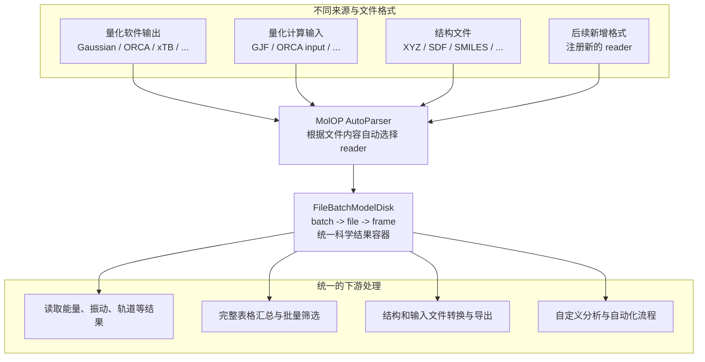

# MolOP

MolOP 是面向计算化学文件的 Python 库和命令行工具。它读取已有的 Gaussian、ORCA、xTB 和结构
文件，自动识别格式，并统一整理为 `batch -> file -> frame` 对象模型。

MolOP 不运行量子化学计算；它负责读取计算结果、批量筛选与汇总、结构转换和后续自动化处理。

## 数据流概览



<div class="grid cards" markdown>

-   :material-download: **第一次使用**

    安装并完成一个可运行示例。

    [安装与验证](getting_started/installation.md){ .md-button }

-   :material-language-python: **使用 Python**

    读取结果、汇总表格和导出结构。

    [5 分钟上手](getting_started/quickstart.md){ .md-button }

-   :material-console: **使用 CLI**

    用一条命令串联解析、筛选和导出。

    [CLI 初体验](getting_started/cli.md){ .md-button }

-   :material-book-open-variant: **查找精确说明**

    查询格式、字段、配置和 API 成员。

    [参考](reference/index.md){ .md-button }

</div>

## 最短可运行流程

```python
from molop import AutoParser

batch = AutoParser("water_mp2.out", n_jobs=1)
frame = batch[0][-1]

print(batch[0].detected_format_id)
print(frame.energies.total_energy.m_as("hartree"))
```

??? example "输出"

    ```text
    orcaout
    -74.999374598107
    ```

输入样例见 [ORCA 水分子文件](../assets/examples/water_mp2.out)。解析结果通过统一字段访问，字段缺失时
保留为 `None`，不会用推测值补齐源文件没有提供的科学结果。

## 按任务进入

| 目标 | 推荐入口 |
| --- | --- |
| 读取单个文件或一批文件 | [解析文件](guides/parsing.md) |
| 读取能量、热化学、振动、轨道或 NMR | [读取计算结果](guides/results.md) |
| 生成 CSV/JSON 汇总表 | [批量汇总](guides/batch.md) |
| 筛选正常结束、优化结果或过渡态 | [过滤与选择](guides/filtering.md) |
| 导出 XYZ、SDF、Gaussian 或 ORCA 输入 | [格式转换与导出](guides/conversion.md) |
| 从坐标恢复金属配合物分子图 | [结构恢复](guides/structure-recovery.md) |
| 排查格式、路径或原生库问题 | [常见问题](guides/troubleshooting.md) |
| 调整日志、并行度和结构恢复策略 | [配置](reference/config.md) |

## 支持范围

当前提供 Gaussian log/fchk/input、ORCA output/input、xTB output、XYZ、SDF/MOL、SMILES 和 CML
相关 reader 或 writer。具体字段、目标格式和信息边界以[格式支持概览](reference/format_support.md)为准。

## 核心数据模型

```text
输入路径或 glob -> AutoParser -> batch -> file -> frame
                                      |       |
                                  批量操作   单次结构与结果
```

需要理解对象层级、frame 选择和惰性结构恢复时，阅读[核心概念](getting_started/concepts.md)。

## 下一步

从[安装与验证](getting_started/installation.md)开始；已有输入文件时直接阅读[5 分钟上手](getting_started/quickstart.md)。
