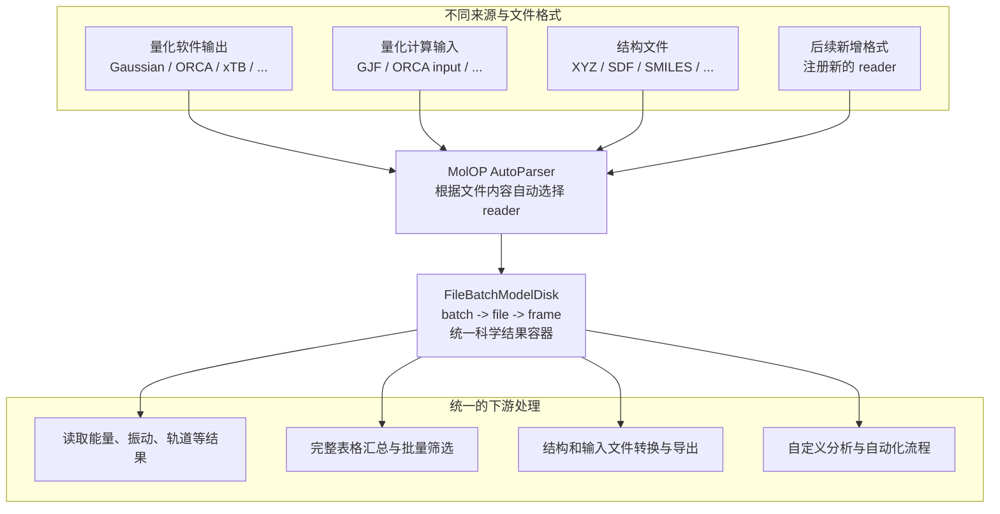

# MolOP

把受支持的计算化学文件直接交给 MolOP：它会根据内容自动识别格式，并将数据归一到统一的
`batch -> file -> frame` 模型。格式差异止于 reader；读取科学结果、生成完整表格、筛选批次、
转换结构和接入自动化工作流，始终使用同一套 Python API 与 CLI。

当前 reader/writer 覆盖和字段边界见[格式支持概览](reference/format_support.md)。

## 选择你的任务

-   :material-download: **安装并验证**

    [安装](getting_started/installation.md){ .md-button }

-   :material-language-python: **使用 Python API**

    [5 分钟上手](getting_started/quickstart.md){ .md-button }

-   :material-console: **使用 CLI**

    [CLI 初体验](getting_started/cli.md){ .md-button }

-   :material-table: **导出结果表**

    [批量汇总](guides/batch.md){ .md-button }

-   :material-share-variant: **恢复分子图**

    [结构恢复](guides/structure-recovery.md){ .md-button }

| 要完成的任务 | 从这里开始 |
| --- | --- |
| 安装并验证环境 | [安装](getting_started/installation.md) |
| 用一个真实文件完成首次解析 | [5 分钟上手](getting_started/quickstart.md) |
| 在 Python 中读取能量、频率、布居或 NMR | [读取计算结果](guides/results.md) |
| 批量导出 CSV | [批量汇总](guides/batch.md) |
| 筛选正常结束、优化结果或过渡态 | [过滤与选择](guides/filtering.md) |
| 从坐标恢复金属配合物分子图 | [结构恢复](guides/structure-recovery.md) |
| 导出 XYZ、SDF、Gaussian 或 ORCA 输入 | [格式转换与导出](guides/conversion.md) |
| 查看某种文件能解析哪些数据 | [格式支持概览](reference/format_support.md) |

## 常见输入

MolOP 当前对 Gaussian log/fchk/input、ORCA output/input、xTB output、XYZ、SDF/MOL、SMILES
和 CML 等格式提供专用 reader 或 writer。具体字段和限制以
[格式支持概览](reference/format_support.md)及各格式页面为准。

MolOP 不运行 Gaussian、ORCA 或 xTB 计算。它处理已有文件，并把结果整理成可查询、可转换的
对象。

## 下一步

[安装 MolOP](getting_started/installation.md)，或直接进入
[5 分钟上手](getting_started/quickstart.md)。
