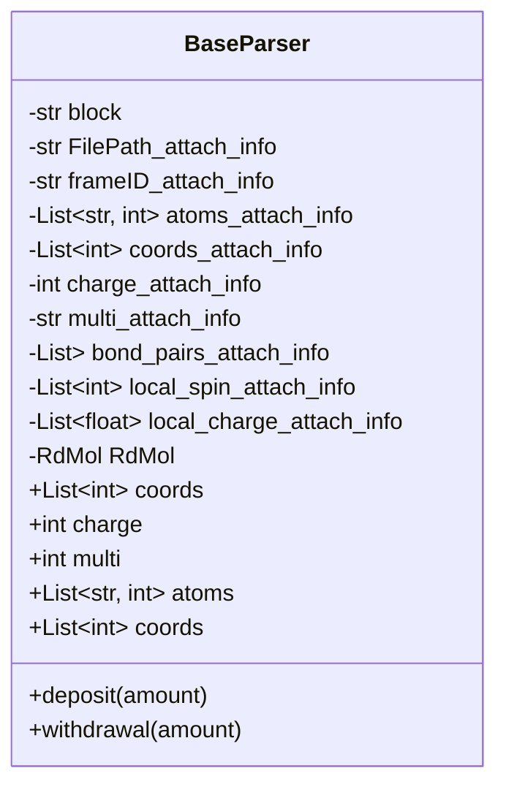
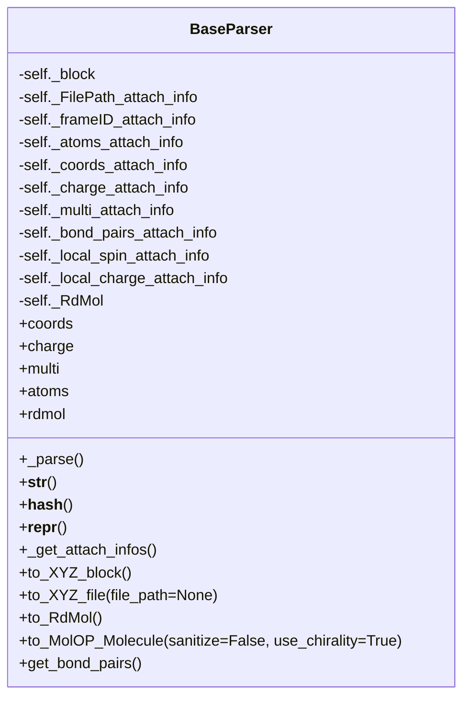

<!--
 * @Author: TMJ
 * @Date: 2023-12-10 13:43:43
 * @LastEditors: TMJ
 * @LastEditTime: 2023-12-10 13:44:23
 * @Description: 请填写简介
-->

# Class design

```mermaid
classDiagram
    class BaseParser
    BaseParser : -str block
    BaseParser : -str FilePath_attach_info
    BaseParser : -str frameID_attach_info
    BaseParser : -List~str, int~ atoms_attach_info
    BaseParser : -List~int~ coords_attach_info
    BaseParser : -int charge_attach_info
    BaseParser : -str multi_attach_info
    BaseParser : -List<Tuple<int>> bond_pairs_attach_info
    BaseParser : -List~int~ local_spin_attach_info
    BaseParser : -List~float~ local_charge_attach_info
    BaseParser : -RdMol RdMol
    BaseParser : +List~int~ coords
    BaseParser : +int charge
    BaseParser : +int multi
    BaseParser : +List~str, int~ atoms
    BaseParser : +List~int~ coords
    BaseParser : +deposit(amount)
    BaseParser : +withdrawal(amount)
```

```mermaid
classDiagram
   class BaseParser
   BaseParser: -self._block
   BaseParser: -self._FilePath_attach_info
   BaseParser: -self._frameID_attach_info
   BaseParser: -self._atoms_attach_info
   BaseParser: -self._coords_attach_info
   BaseParser: -self._charge_attach_info
   BaseParser: -self._multi_attach_info
   BaseParser: -self._bond_pairs_attach_info
   BaseParser: -self._local_spin_attach_info
   BaseParser: -self._local_charge_attach_info
   BaseParser: -self._RdMol
   BaseParser: +_parse()
   BaseParser: +coords
   BaseParser: +charge
   BaseParser: +multi
   BaseParser: +atoms
   BaseParser: +__str__()
   BaseParser:+__hash__()
   BaseParser:+__repr__()
   BaseParser:+_get_attach_infos()
   BaseParser:+to_XYZ_block()
   BaseParser:+to_XYZ_file(file_path=None)
   BaseParser:+to_RdMol()
   BaseParser:+rdmol
   BaseParser:+to_MolOP_Molecule(sanitize=False, use_chirality=True)
   BaseParser:+get_bond_pairs()
```
